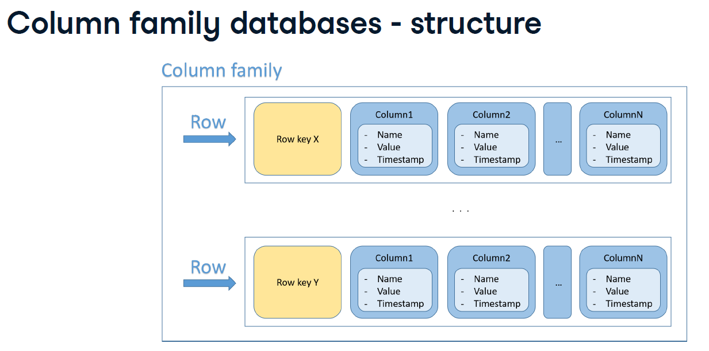

# NoSql_Concepts
The Concepts of NoSql

# NoSQL vs. Relational Databases: A Comparison (NoSQL vs. Bancos de Dados Relacionais: Uma Comparação)

Databases are fundamental components of almost any software system, storing and managing data. The choice between relational (SQL) and non-relational (NoSQL) databases depends heavily on the specific needs of an application, considering factors like data structure, scalability requirements, and transaction integrity. This document outlines the key characteristics of both paradigms.

---

## English Version

### Relational Databases

Relational databases are based on the relational model, which organizes data into tables, rows, and columns. They are known for their structured approach and strong consistency.

* **Use tables/rows/columns:** Data is stored in a structured format, resembling a spreadsheet, with predefined relationships between tables.
* **Need a predefined schema/complicated to change:** Before data can be added, the structure (schema) of the tables must be explicitly defined. Altering this schema (e.g., adding a new column) can be complex and time-consuming, especially for large datasets.
* **Slow queries when joining multiple tables:** While joins are powerful for relating data, performing complex joins across many large tables can be computationally intensive and lead to slower query performance.
* **Vertically scalable:** Relational databases primarily scale by adding more power to a single server (e.g., more CPU, RAM, faster storage).
    * **Scale by adding more power (e.g., CPU, RAM...)**
    * **More expensive:** Vertical scaling typically involves upgrading hardware, which can become prohibitively expensive as requirements grow.
* **Guarantee ACID transactions:** Relational databases strongly adhere to ACID properties (Atomicity, Consistency, Isolation, Durability), ensuring that transactions are processed reliably, maintaining data integrity even during failures.
* **Typically closed source:** Many traditional relational database systems are proprietary or closed-source, although open-source options exist (e.g., PostgreSQL, MySQL).

### NoSQL Databases

NoSQL (originally "not only SQL") databases provide a flexible and scalable alternative to the relational model. They encompass a variety of data models, including document, key-value, column-family, and graph.

* **Originally non-SQL/non-relational:** These databases emerged as alternatives to traditional SQL databases, offering different ways to store and retrieve data.
* **Not only SQL:** The term "NoSQL" now often means "Not only SQL," indicating that while some may support SQL-like query languages, their fundamental data model is not relational.
* **Non-relational databases:** Their data models vary significantly from the rigid table-based structure of relational databases.
* **Don't use tables/rows/columns:** Instead, they use diverse structures like documents (JSON/BSON), key-value pairs, wide columns, or graphs.
* **Schema-less/easy changes:** Most NoSQL databases are schema-less or offer flexible schemas, meaning data can be added without a predefined structure. This allows for easier and faster changes to the data model as application requirements evolve.
* **Fast queries:** Queries within a single document or simple key-value lookups can be extremely fast due to their optimized data models for specific access patterns and avoidance of complex joins.
* **Horizontal scalable/cheaper:** NoSQL databases are designed for horizontal scalability, meaning they can scale by adding more servers to a distributed cluster rather than upgrading a single powerful server. This is generally more cost-effective.
* **Most don't support ACID transactions:** While some NoSQL databases offer partial ACID compliance, many prioritize availability and partition tolerance over strict consistency (following the CAP theorem), meaning full ACID guarantees are not always provided across distributed operations.
* **Open source:** A significant number of NoSQL databases are open-source projects, which can offer cost advantages and community support.

---

## Versão em Português

# NoSQL vs. Bancos de Dados Relacionais: Uma Comparação

Bancos de dados são componentes fundamentais de quase todo sistema de software, armazenando e gerenciando dados. A escolha entre bancos de dados relacionais (SQL) e não relacionais (NoSQL) depende muito das necessidades específicas de uma aplicação, considerando fatores como estrutura de dados, requisitos de escalabilidade e integridade transacional. Este documento descreve as principais características de ambos os paradigmas.

---

## Versão em Português

### Bancos de Dados Relacionais

Bancos de dados relacionais são baseados no modelo relacional, que organiza os dados em tabelas, linhas e colunas. Eles são conhecidos por sua abordagem estruturada e forte consistência.

* **Usam tabelas/linhas/colunas:** Os dados são armazenados em um formato estruturado, semelhante a uma planilha, com relacionamentos predefinidos entre as tabelas.
* **Precisam de um esquema predefinido/complicado para mudar:** Antes que os dados possam ser adicionados, a estrutura (esquema) das tabelas deve ser explicitamente definida. Alterar esse esquema (ex: adicionar uma nova coluna) pode ser complexo e demorado, especialmente para grandes conjuntos de dados.
* **Consultas lentas ao unir múltiplas tabelas:** Embora as junções sejam poderosas para relacionar dados, a realização de junções complexas em muitas tabelas grandes pode ser computacionalmente intensiva e levar a um desempenho de consulta mais lento.
* **Escaláveis verticalmente:** Bancos de dados relacionais escalam principalmente adicionando mais poder a um único servidor (ex: mais CPU, RAM, armazenamento mais rápido).
    * **Escalam adicionando mais poder (ex: CPU, RAM...)**
    * **Mais caros:** A escalabilidade vertical tipicamente envolve a atualização de hardware, o que pode se tornar proibitivamente caro à medida que os requisitos aumentam.
* **Garantem transações ACID:** Bancos de dados relacionais aderem fortemente às propriedades ACID (Atomicidade, Consistência, Isolamento, Durabilidade), garantindo que as transações sejam processadas de forma confiável, mantendo a integridade dos dados mesmo durante falhas.
* **Tipicamente de código fechado:** Muitos sistemas de banco de dados relacionais tradicionais são proprietários ou de código fechado, embora existam opções de código aberto (ex: PostgreSQL, MySQL).

### Bancos de Dados NoSQL

NoSQL (originalmente "não apenas SQL") fornecem uma alternativa flexível e escalável ao modelo relacional. Eles englobam uma variedade de modelos de dados, incluindo documento, chave-valor, coluna-família e grafo.

* **Originalmente não-SQL/não-relacional:** Esses bancos de dados surgiram como alternativas aos bancos de dados SQL tradicionais, oferecendo diferentes maneiras de armazenar e recuperar dados.
* **Não apenas SQL:** O termo "NoSQL" agora frequentemente significa "Não apenas SQL", indicando que, embora alguns possam suportar linguagens de consulta semelhantes ao SQL, seu modelo de dados fundamental não é relacional.
* **Bancos de dados não relacionais:** Seus modelos de dados variam significativamente da estrutura rígida baseada em tabelas dos bancos de dados relacionais.
* **Não usam tabelas/linhas/colunas:** Em vez disso, usam estruturas diversas como documentos (JSON/BSON), pares chave-valor, colunas largas ou grafos.
* **Sem esquema/mudanças fáceis:** A maioria dos bancos de dados NoSQL não possui esquema ou oferece esquemas flexíveis, o que significa que os dados podem ser adicionados sem uma estrutura predefinida. Isso permite mudanças mais fáceis e rápidas no modelo de dados à medida que os requisitos da aplicação evoluem.
* **Consultas rápidas:** Consultas dentro de um único documento ou buscas simples por chave-valor podem ser extremamente rápidas devido aos seus modelos de dados otimizados para padrões de acesso específicos e à evitação de junções complexas.
* **Escaláveis horizontalmente/mais baratos:** Bancos de dados NoSQL são projetados para escalabilidade horizontal, o que significa que podem escalar adicionando mais servidores a um cluster distribuído em vez de atualizar um único servidor poderoso. Isso é geralmente mais econômico.
* **A maioria não suporta transações ACID:** Embora alguns bancos de dados NoSQL ofereçam conformidade ACID parcial, muitos priorizam a disponibilidade e a tolerância a partição em detrimento da consistência estrita (seguindo o teorema CAP), o que significa que garantias ACID completas nem sempre são fornecidas em operações distribuídas.
* **Código aberto:** Um número significativo de bancos de dados NoSQL são projetos de código aberto, o que pode oferecer vantagens de custo e suporte da comunidade.


# Data Value: Understanding its Nature and Operations (Valor de Dados: Compreendendo sua Natureza e Operações)

In many data storage paradigms, especially key-value stores and various NoSQL databases, data is fundamentally organized into pairs. This document explains the characteristics and common operations associated with the 'value' component of such pairs.

---

## English Version

### Characteristics and Operations of Data Values

A 'value' in data storage is an actual piece of information that is linked to a unique identifier, often referred to as a 'key'.

* **Associated with a key.**
    * **Explanation:** Every value is inextricably linked to a specific key. This key acts as its unique address or identifier, allowing for efficient retrieval and management of that particular piece of data. Without its associated key, a value cannot be directly accessed or modified in a key-value system.

* **Retrieve, set, delete a value by key.**
    * **Explanation:** The primary operations performed on values revolve around their keys.
        * **Retrieve (Read):** To get a value, you typically provide its associated key.
        * **Set (Create/Update):** To store a new value or update an existing one, you provide the key along with the new value.
        * **Delete:** To remove a value, you specify its key.
    These simple, atomic operations make key-value systems highly efficient for specific use cases.

* **Numbers, strings, JSON, images...**
    * **Explanation:** One of the significant advantages of the 'value' concept, especially in NoSQL systems, is its flexibility regarding data types. A value is essentially schema-less, meaning it can store almost any kind of data. This includes simple data types like numbers and strings, complex structured data like JSON objects, or even unstructured binary data such as images, videos, or entire files. This flexibility contrasts sharply with the rigid schema requirements of traditional relational database columns.

---

## Versão em Português

# Valor de Dados: Compreendendo sua Natureza e Operações

Em muitos paradigmas de armazenamento de dados, especialmente em armazenamentos chave-valor e vários bancos de dados NoSQL, os dados são fundamentalmente organizados em pares. Este documento explica as características e operações comuns associadas ao componente 'valor' de tais pares.

---

## Versão em Português

### Características e Operações de Valores de Dados

Um 'valor' no armazenamento de dados é uma peça real de informação que está ligada a um identificador único, frequentemente referido como 'chave'.

* **Associado a uma chave.**
    * **Explicação:** Todo valor está intrinsecavelmente ligado a uma chave específica. Essa chave atua como seu endereço ou identificador único, permitindo a recuperação e o gerenciamento eficientes dessa peça de dado em particular. Sem sua chave associada, um valor não pode ser acessado ou modificado diretamente em um sistema chave-valor.

* **Recuperar, definir, excluir um valor por chave.**
    * **Explicação:** As operações primárias realizadas em valores giram em torno de suas chaves.
        * **Recuperar (Ler):** Para obter um valor, você tipicamente fornece sua chave associada.
        * **Definir (Criar/Atualizar):** Para armazen

# Data Size Restrictions (Restrições de Tamanho de Dados)

Understanding data size restrictions is crucial in various aspects of software development and data management, particularly when dealing with storage, transmission, and processing.

---

## English Version

### What are Data Size Restrictions?

Data size restrictions refer to limits on the amount of data that can be stored in a single unit, transmitted in a single message, or processed within a given operation or system. These limits can be imposed by various factors:

* **Database Systems:**
    * Many database systems (especially key-value stores or document databases) may have limits on the maximum size of a single 'value' or document that can be stored in a record.
    * Relational database columns might have character limits (e.g., `VARCHAR(255)`), or limits on blob/text fields.
* **APIs and Protocols:**
    * HTTP requests/responses can have maximum body sizes.
    * Specific API endpoints might have limits on the size of JSON payloads they accept.
    * Messaging queues (like Kafka topics) may have maximum message size configurations.
* **File Systems:**
    * File systems have limits on the maximum file size or partition size.
* **Memory and Processing:**
    * Even if storage allows large data, the amount of memory available for processing or transmitting that data at runtime can impose practical size restrictions.

**Implications:** Ignoring size restrictions can lead to various issues, including data truncation, processing errors, performance degradation, network timeouts, or complete system failures. Developers and architects must design systems with these limitations in mind, potentially opting for different data models (e.g., storing large files in object storage and links in the database) or processing strategies (e.g., streaming large data).

---

## Versão em Português

### O que são Restrições de Tamanho de Dados?

Restrições de tamanho de dados referem-se a limites na quantidade de dados que podem ser armazenados em uma única unidade, transmitidos em uma única mensagem ou processados dentro de uma determinada operação ou sistema. Esses limites podem ser impostos por vários fatores:

* **Sistemas de Banco de Dados:**
    * Muitos sistemas de banco de dados (especialmente armazenamentos chave-valor ou bancos de dados de documentos) podem ter limites no tamanho máximo de um único 'valor' ou documento que pode ser armazenado em um registro.
    * Colunas de bancos de dados relacionais podem ter limites de caracteres (ex: `VARCHAR(255)`) ou limites em campos de blob/texto.
* **APIs e Protocolos:**
    * Requisições/respostas HTTP podem ter tamanhos máximos de corpo.
    * Endpoints de API específicos podem ter limites no tamanho dos payloads JSON que aceitam.
    * Filas de mensagens (como tópicos Kafka) podem ter configurações de tamanho máximo de mensagem.
* **Sistemas de Arquivos:**
    * Sistemas de arquivos possuem limites no tamanho máximo de arquivo ou no tamanho da partição.
* **Memória e Processamento:**
    * Mesmo que o armazenamento permita grandes volumes de dados, a quantidade de memória disponível para processar ou transmitir esses dados em tempo de execução pode impor restrições práticas de tamanho.

**Implicações:** Ignorar as restrições de tamanho pode levar a vários problemas, incluindo truncamento de dados, erros de processamento, degradação de desempenho, timeouts de rede ou falhas completas do sistema. Desenvolvedores e arquitetos devem projetar sistemas com essas limitações em mente, optando potencialmente por diferentes modelos de dados (ex: armazenar arquivos grandes em armazenamento de objetos e links no banco de dados) ou estratégias de processamento (ex: streaming de grandes volumes de dados).

# Database Paradigms: NoSQL vs. Relational (Paradigmas de Banco de Dados: NoSQL vs. Relacional)

The choice between NoSQL and relational databases is a fundamental decision in software architecture, driven by the nature of the data, flexibility requirements, and performance needs. This document highlights key characteristics and ideal use cases for each database paradigm.

---

## English Version

### NoSQL Database

NoSQL databases offer a flexible and scalable approach to data storage, diverging from the traditional rigid structure of relational databases.

* **A better fit for new projects with unclear schemas.**
    * **Explanation:** NoSQL databases are often schema-less or have flexible schemas. This makes them ideal for agile development, rapidly evolving data models, or when the data structure is not fully known at the outset of a project, allowing for quick iteration and adaptation.
* **This type of database doesn't use tables, rows, and columns to store data.**
    * **Explanation:** Unlike relational databases, NoSQL databases employ various data models such as document (JSON/BSON), key-value, column-family, or graph. This allows for diverse ways of organizing and accessing data, optimized for specific types of applications.
* **This type of database can achieve high-speed queries because there is no need to join multiple tables.**
    * **Explanation:** Many NoSQL databases are designed to store related data together in a single record or document, eliminating the need for complex and resource-intensive 'join' operations that are common in relational databases. This denormalization can lead to significantly faster read queries for specific access patterns.

### Relational Database

Relational databases are built upon the relational model, emphasizing structured data, predefined schemas, and strong consistency through relationships between tables.

* **A better fit for projects that need rigid schemas.**
    * **Explanation:** Relational databases excel when data has a well-defined, consistent structure that is unlikely to change frequently. Their rigid schema enforces data integrity and ensures that all data conforms to a set of rules, which is critical for applications requiring high data consistency.
* **This type of database needs a defined schema before inserting the data.**
    * **Explanation:** A core requirement of relational databases is that the structure of tables, including column names, data types, and relationships, must be explicitly defined (schema-on-write) before any data can be stored. This upfront planning ensures data integrity and consistency but can make initial development slower or harder to change later.

---

## Versão em Português

# Paradigmas de Banco de Dados: NoSQL vs. Relacional

A escolha entre bancos de dados NoSQL e relacionais é uma decisão fundamental na arquitetura de software, impulsionada pela natureza dos dados, requisitos de flexibilidade e necessidades de desempenho. Este documento destaca as principais características e casos de uso ideais para cada paradigma de banco de dados.

---

## Versão em Português

### Banco de Dados NoSQL

Bancos de dados NoSQL oferecem uma abordagem flexível e escalável para o armazenamento de dados, divergindo da estrutura rígida tradicional dos bancos de dados relacionais.

* **Uma opção melhor para novos projetos com esquemas pouco claros.**
    * **Explicação:** Bancos de dados NoSQL são frequentemente sem esquema (schema-less) ou possuem esquemas flexíveis. Isso os torna ideais para desenvolvimento ágil, modelos de dados em rápida evolução, ou quando a estrutura dos dados não é totalmente conhecida no início de um projeto, permitindo iteração e adaptação rápidas.
* **Este tipo de banco de dados não usa tabelas, linhas e colunas para armazenar dados.**
    * **Explicação:** Ao contrário dos bancos de dados relacionais, os bancos de dados NoSQL empregam vários modelos de dados, como documento (JSON/BSON), chave-valor, família de colunas ou grafo. Isso permite diversas formas de organizar e acessar dados, otimizadas para tipos específicos de aplicações.
* **Este tipo de banco de dados pode alcançar consultas de alta velocidade porque não há necessidade de unir múltiplas tabelas.**
    * **Explicação:** Muitos bancos de dados NoSQL são projetados para armazenar dados relacionados juntos em um único registro ou documento, eliminando a necessidade de operações de 'junção' (join) complexas e com uso intensivo de recursos, que são comuns em bancos de dados relacionais. Essa desnormalização pode levar a consultas de leitura significativamente mais rápidas para padrões de acesso específicos.

### Banco de Dados Relacional

Bancos de dados relacionais são construídos sobre o modelo relacional, enfatizando dados estruturados, esquemas predefinidos e forte consistência através de relacionamentos entre tabelas.

* **Uma opção melhor para projetos que precisam de esquemas rígidos.**
    * **Explicação:** Bancos de dados relacionais se destacam quando os dados possuem uma estrutura bem definida e consistente, que dificilmente mudará com frequência. Seu esquema rígido impõe a integridade dos dados e garante que todos os dados estejam em conformidade com um conjunto de regras, o que é crítico para aplicações que exigem alta consistência de dados.
* **Este tipo de banco de dados precisa de um esquema definido antes de inserir os dados.**
    * **Explicação:** Um requisito central dos bancos de dados relacionais é que a estrutura das tabelas, incluindo nomes de colunas, tipos de dados e relacionamentos, deve ser explicitamente definida (schema-on-write) antes que quaisquer dados possam ser armazenados. Esse planejamento inicial garante a integridade e consistência dos dados, mas pode tornar o desenvolvimento inicial mais lento ou mais difícil de alterar posteriormente.


# Data Storage: Understanding Key-Value Pairs (Armazenamento de Dados: Compreendendo Pares Chave-Valor)

In various data storage systems, particularly NoSQL databases, data is fundamentally organized into key-value pairs. This simple yet powerful structure allows for efficient storage and retrieval of information. Each piece of data is associated with a unique identifier (the "Key"), which is then used to access the actual content (the "Value").

---

## English Version

### The Key Component

The "Key" is the unique identifier used to locate and access data within a key-value store. It serves as the address or label for the stored information.

* **The left part of this tuple.**
    * **Explanation:** In a key-value pair (often thought of as a "tuple" or pair of items), the key is the first element, positioned on the left.
* **You can find a record using this.**
    * **Explanation:** The primary purpose of a key is to act as a direct lookup mechanism. To retrieve, update, or delete a piece of data, you simply provide its corresponding key. This direct mapping makes key-value lookups extremely fast.
* **It must be unique.**
    * **Explanation:** For data integrity and unambiguous retrieval, each key within a given dataset or namespace must be distinct. If keys were not unique, the system wouldn't know which specific value to return when a key is queried.

### The Value Component

The "Value" is the actual data or content that is stored and associated with a particular key. It represents the information you are trying to retrieve or manage.

* **The right part of this tuple.**
    * **Explanation:** In a key-value pair, the value is the second element, positioned on the right, directly linked to its unique key.
* **It doesn't matter if it is repeated.**
    * **Explanation:** Unlike keys, values do not need to be unique. Multiple different keys can point to the exact same value. For example, two different users (identified by unique keys) might have the same default "Hello world!" message as a value. The system is designed to retrieve the value associated with *the key provided*, regardless of whether that value content is also associated with other keys.

This key-value paradigm offers simplicity, high performance for direct lookups, and flexibility in the type of data that can be stored as a value, making it suitable for a wide range of applications, especially those requiring high scalability and availability.

---

## Versão em Português

# Armazenamento de Dados: Compreendendo Pares Chave-Valor

Em vários sistemas de armazenamento de dados, particularmente em bancos de dados NoSQL, os dados são fundamentalmente organizados em pares chave-valor. Esta estrutura simples, porém poderosa, permite o armazenamento e a recuperação eficientes de informações. Cada dado é associado a um identificador único (a "Chave"), que é então usado para acessar o conteúdo real (o "Valor").

---

## Versão em Português

### O Componente Chave

A "Chave" é o identificador único usado para localizar e acessar dados dentro de um armazenamento chave-valor. Ela serve como o endereço ou rótulo para a informação armazenada.

* **A parte esquerda deste par (tupla).**
    * **Explicação:** Em um par chave-valor (frequentemente pensado como uma "tupla" ou par de itens), a chave é o primeiro elemento, posicionado à esquerda.
* **Você pode encontrar um registro usando isso.**
    * **Explicação:** O propósito principal de uma chave é atuar como um mecanismo de busca direta. Para recuperar, atualizar ou excluir um dado, você simplesmente fornece sua chave correspondente. Essa associação direta torna as buscas por chave-valor extremamente rápidas.
* **Deve ser única.**
    * **Explicação:** Para a integridade dos dados e recuperação inequívoca, cada chave dentro de um determinado conjunto de dados ou namespace deve ser distinta. Se as chaves não fossem únicas, o sistema não saberia qual valor específico retornar quando uma chave fosse consultada.

### O Componente Valor

O "Valor" é o dado ou conteúdo real que é armazenado e associado a uma chave específica. Ele representa a informação que você está tentando recuperar ou gerenciar.

* **A parte direita deste par (tupla).**
    * **Explicação:** Em um par chave-valor, o valor é o segundo elemento, posicionado à direita, diretamente ligado à sua chave única.
* **Não importa se ele é repetido.**
    * **Explicação:** Ao contrário das chaves, os valores não precisam ser únicos. Várias chaves diferentes podem apontar para o mesmo valor. Por exemplo, dois usuários diferentes (identificados por chaves únicas) podem ter a mesma mensagem padrão "Hello world!" como valor. O sistema é projetado para recuperar o valor associado *à chave fornecida*, independentemente de esse conteúdo do valor também estar associado a outras chaves.


# Key Advantages of Modern Data Storage Systems (Vantagens Chave de Sistemas Modernos de Armazenamento de Dados)

Modern data storage systems, particularly key-value stores and certain NoSQL databases, offer compelling advantages that make them suitable for a wide range of applications, especially those requiring high performance, flexibility, and scalability. These benefits include simplicity, adaptability to changing data needs, speed due to in-memory processing, and efficient horizontal scaling.

---

## English Version

### 1. Very Simple

These systems are inherently designed for ease of use and straightforward data handling.

* **Key-value tuple:** Data is organized in simple pairs, where each unique key maps directly to a specific value. This fundamental structure simplifies data modeling and access.
* **No defined schema/types:** Unlike traditional relational databases, there's often no rigid predefined schema. This means you don't need to define the structure of your data (like column types) upfront, allowing for more agile development and easy adaptation to evolving data requirements.
* **Basic operations:** The primary operations are straightforward and intuitive:
    * **Put:** Used to insert a new key-value pair or update the value associated with an existing key.
    * **Get:** Used to retrieve the value corresponding to a given key.
    * **Delete:** Used to remove a key and its associated value from the store.

### 2. Flexible

The flexibility of these systems allows for dynamic data structures and easy evolution.

* **Allow changes in data types:** You can update a value associated with a key to a completely different data type without needing to alter a schema. For example, a value previously stored as a number (`userID:123 = 123456`) can later be updated to a string (`userID:123 = "Miriam"`).
* **Add additional attributes:** It's simple to add new attributes or fields to existing data records (values). For instance, an existing preference object (`user:457:preferences = {"language" : "en:US"}`) can be easily extended with new fields like `color` and `timezone` (`user:457:preferences = {"language" : "en:US", "color" : "green", "timezone" : "GTM-4"}`).

### 3. Information Stored in Memory

Leveraging memory for data storage provides significant performance gains, though with considerations for persistence.

* **Fast reads/writes:** Storing data primarily in RAM allows for extremely rapid data retrieval and storage operations, as memory access is orders of magnitude faster than disk access. This makes these systems ideal for high-throughput and low-latency applications.
* **Can lose data:** If data is *only* stored in memory, there's a risk of losing it in case of system failures (e.g., power loss, server crash) before it's persisted to durable storage.
* **Combination of disk and memory persistence:** Many systems overcome the data loss risk by combining in-memory storage for speed with periodic or asynchronous persistence to disk, offering a balance between performance and durability.

### 4. Scalability

These systems are designed for horizontal scaling, efficiently handling growth in data volume and traffic.

* **Can scale horizontally:** Instead of upgrading a single, more powerful server (vertical scaling), these systems can scale by adding more commodity servers to a cluster. This is generally more cost-effective and provides near-linear performance improvements.
* **Sharding:** This technique involves distributing different parts of the data across multiple servers. Each server (or "shard") holds a subset of the total data. When a request comes in, it's routed to the appropriate shard, allowing for parallel processing and enabling the system to handle massive datasets and high request rates.

---

## Versão em Português

# Vantagens Chave de Sistemas Modernos de Armazenamento de Dados

Sistemas modernos de armazenamento de dados, particularmente armazenamentos chave-valor e certos bancos de dados NoSQL, oferecem vantagens convincentes que os tornam adequados para uma ampla gama de aplicações, especialmente aquelas que exigem alto desempenho, flexibilidade e escalabilidade. Esses benefícios incluem simplicidade, adaptabilidade às necessidades de dados em mudança, velocidade devido ao processamento em memória e escalabilidade horizontal eficiente.

---

## Versão em Português

### 1. Muito Simples

Esses sistemas são inerentemente projetados para facilidade de uso e manuseio direto de dados.

* **Par chave-valor:** Os dados são organizados em pares simples, onde cada chave única mapeia diretamente para um valor específico. Essa estrutura fundamental simplifica a modelagem e o acesso aos dados.
* **Sem esquema/tipos definidos:** Ao contrário dos bancos de dados relacionais tradicionais, frequentemente não há um esquema rígido predefinido. Isso significa que você não precisa definir a estrutura dos seus dados (como tipos de coluna) antecipadamente, permitindo um desenvolvimento mais ágil e fácil adaptação a requisitos de dados em evolução.
* **Operações básicas:** As operações primárias são diretas e intuitivas:
    * **Put:** Usado para inserir um novo par chave-valor ou atualizar o valor associado a uma chave existente.
    * **Get:** Usado para retornar o valor por uma dada chave.
    * **Delete:** Usado para remover uma chave e seu valor.

### 2. Flexível

A flexibilidade desses sistemas permite estruturas de dados dinâmicas e fácil evolução.

* **Permitem mudanças em tipos de dados:** Você pode atualizar um valor associado a uma chave para um tipo de dado completamente diferente sem a necessidade de alterar um esquema. Por exemplo, um valor previamente armazenado como um número (`userID:123 = 123456`) pode ser posteriormente atualizado para uma string (`userID:123 = "Miriam"`).
* **Adicionar atributos adicionais:** É simples adicionar novos atributos ou campos a registros de dados (valores) existentes. Por exemplo, um objeto de preferência existente (`user:457:preferences = {"language" : "en:US"}`) pode ser facilmente estendido com novos campos como `color` e `timezone` (`user:457:preferences = {"language" : "en:US", "color" : "green", "timezone" : "GTM-4"}`).

### 3. Informações Armazenadas em Memória

A utilização da memória para armazenamento de dados proporciona ganhos significativos de desempenho, embora com considerações sobre persistência.

* **Leituras/gravações rápidas:** Armazenar dados principalmente na RAM permite operações de recuperação e armazenamento de dados extremamente rápidas, pois o acesso à memória é ordens de magnitude mais rápido que o acesso ao disco. Isso torna esses sistemas ideais para aplicações de alto throughput e baixa latência.
* **Pode perder dados:** Se os dados são armazenados *apenas* na memória, há risco de perdê-los em caso de falhas do sistema (ex: falta de energia, travamento do servidor) antes que sejam persistidos em armazenamento durável.
* **Combinação de persistência em disco e memória:** Muitos sistemas superam o risco de perda de dados combinando o armazenamento em memória para velocidade com persistência periódica ou assíncrona em disco, oferecendo um equilíbrio entre desempenho e durabilidade.

### 4. Escalabilidade

Esses sistemas são projetados para escalabilidade horizontal, lidando eficientemente com o crescimento do volume de dados e do tráfego.

* **Pode escalar horizontalmente:** Em vez de atualizar um único servidor mais poderoso (escalabilidade vertical), esses sistemas podem escalar adicionando mais servidores comuns a um cluster. Isso é geralmente mais econômico e oferece melhorias de desempenho quase lineares.
* **Sharding:** Esta técnica envolve a distribuição de diferentes partes dos dados entre múltiplos servidores. Cada servidor (ou "shard") mantém um subconjunto do total de dados. Quando uma requisição chega, ela é roteada para o shard apropriado, permitindo processamento paralelo e capacitando o sistema a lidar com conjuntos de dados massivos e altas taxas de requisição.

Este paradigma chave-valor oferece simplicidade, alto desempenho para buscas diretas e flexibilidade no tipo de dados que podem ser armazenados como valor, tornando-o adequado para uma ampla gama de aplicações, especialmente aquelas que exigem alta escalabilidade e disponibilidade.


# Limitations of Key-Value Stores (Limitações de Armazenamentos Chave-Valor)

While key-value stores offer significant advantages in simplicity, speed, and scalability, they also come with certain limitations, primarily concerning their query capabilities. Understanding these constraints is crucial for choosing the right database for a specific use case.

---

## English Version

### Primary Limitations

The fundamental design of key-value stores, focused on fast direct lookups, inherently limits their flexibility for complex data retrieval.

* **Just search by key.**
    * **Explanation:** The most basic and efficient way to retrieve data from a key-value store is by providing its unique key. This direct access mechanism is incredibly fast but poses a challenge if you need to find data based on its content rather than its identifier.
    * **Problem if we don't know the key:** If the specific key for a piece of information is unknown, or if you need to find data based on criteria within the values, a simple key-value store cannot perform this operation directly. This necessitates external indexing or a full scan, which can be inefficient for large datasets.

### Evolving Functionalities and Remaining Challenges

To address the limitations of strict key-based searching, some key-value databases have evolved to offer enhanced functionalities:

* **Some key-value databases added functionalities:**
    * **Search by value:** Certain key-value stores now allow you to search for data based on the content of the values themselves, not just the key.
    * **Add secondary indexes:** This feature enables creating additional indexes on specific attributes within the values, allowing for efficient searches on those attributes, similar to indexes in relational databases.
    * **Search by several keys simultaneously:** Some implementations support querying multiple keys in a single operation, improving efficiency for fetching related data.

* **Not complex queries.**
    * **Explanation:** Despite these added functionalities, key-value stores are generally *not* designed for complex analytical queries that involve sophisticated joins across multiple data types or aggregations that span vast datasets. Such operations are typically better handled by relational databases or specialized analytical data stores. The core strength remains fast, direct access via keys.

---

## Versão em Português

# Limitações de Armazenamentos Chave-Valor

Embora os armazenamentos chave-valor ofereçam vantagens significativas em simplicidade, velocidade e escalabilidade, eles também vêm com certas limitações, principalmente no que diz respeito às suas capacidades de consulta. Compreender essas restrições é crucial para escolher o banco de dados certo para um caso de uso específico.

---

## Versão em Português

### Limitações Principais

O design fundamental dos armazenamentos chave-valor, focado em buscas diretas rápidas, limita inerentemente sua flexibilidade para recuperação de dados complexa.

* **Apenas busca por chave.**
    * **Explicação:** A maneira mais básica e eficiente de recuperar dados de um armazenamento chave-valor é fornecendo sua chave única. Este mecanismo de acesso direto é incrivelmente rápido, mas representa um desafio se você precisar encontrar dados com base em seu conteúdo, em vez de seu identificador.
    * **Problema se não soubermos a chave:** Se a chave específica para uma informação é desconhecida, ou se você precisa encontrar dados com base em critérios dentro dos valores, um armazenamento chave-valor simples não pode realizar essa operação diretamente. Isso exige indexação externa ou uma varredura completa, o que pode ser ineficiente para grandes conjuntos de dados.

### Funcionalidades em Evolução e Desafios Restantes

Para abordar as limitações da busca estrita baseada em chave, alguns bancos de dados chave-valor evoluíram para oferecer funcionalidades aprimoradas:

* **Alguns bancos de dados chave-valor adicionaram funcionalidades:**
    * **Busca por valor:** Certos armazenamentos chave-valor agora permitem que você busque dados com base no conteúdo dos próprios valores, e não apenas na chave.
    * **Adicionar índices secundários:** Este recurso permite criar índices adicionais em atributos específicos dentro dos valores, permitindo buscas eficientes nesses atributos, semelhante aos índices em bancos de dados relacionais.
    * **Buscar por várias chaves simultaneamente:** Algumas implementações suportam a consulta de múltiplas chaves em uma única operação, melhorando a eficiência para buscar dados relacionados.

* **Não há consultas complexas.**
    * **Explicação:** Apesar dessas funcionalidades adicionais, os armazenamentos chave-valor geralmente *não* são projetados para consultas analíticas complexas que envolvem junções sofisticadas entre vários tipos de dados ou agregações que abrangem vastos conjuntos de dados. Tais operações são tipicamente melhor tratadas por bancos de dados relacionais ou armazenamentos de dados analíticos especializados. A força central permanece no acesso rápido e direto via chaves.
 


# Key-Value Databases: Advantages, Limitations, and Core Concepts (Bancos de Dados Chave-Valor: Vantagens, Limitações e Conceitos Centrais)

Key-value databases represent a fundamental type of NoSQL database, known for their straightforward data model and high performance. This document summarizes their primary advantages and limitations, along with clarifying common misconceptions.

---

## English Version

### Advantages of Key-Value Databases

Key-value stores offer several compelling benefits that make them suitable for specific application needs:

* **Flexibility:**
    * **Explanation:** These databases allow for agile development and easy adaptation to evolving data requirements. They often don't enforce a rigid schema, meaning the structure of the data (the "value") associated with a key can change without requiring schema migrations. This also allows for changes in data types for a given key, or the addition of new attributes.
* **Simplicity:**
    * **Explanation:** The core data model is straightforward: a unique key maps to a value. Operations are typically limited to basic `Put` (insert/update), `Get` (retrieve), and `Delete` (remove) by key. This simplicity leads to easier development and management.
* **Horizontal scalability:**
    * **Explanation:** Key-value databases are designed to scale out by distributing data across many servers (sharding), rather than scaling up a single server. This allows them to handle massive amounts of data and high user traffic efficiently and cost-effectively.
* **In-memory storage:**
    * **Explanation:** Many key-value stores can primarily store data in RAM for extremely fast read and write operations. While this might introduce considerations for data persistence (e.g., in case of power loss), modern systems often combine in-memory storage with disk persistence for durability.

### Limitations of Key-Value Databases

Despite their advantages, key-value databases also have specific limitations:

* **Just search by key:**
    * **Explanation:** The primary method of data retrieval is by providing the exact key. This can be a limitation if you need to query data based on attributes *within* the value or perform complex analytical queries that involve relationships between different data entries.

### Clarifying Key-Value Concepts (True/False)

Here are some statements to further clarify the functionalities and properties of key-value databases:

* **Some key-value databases allow secondary indexes to specific value attributes to be created.**
    * **Explanation:** This is **True**. While a core limitation is searching only by key, many advanced key-value stores have introduced secondary indexing features. These indexes allow for efficient querying on non-key attributes within the stored values, mitigating the "just search by key" limitation for specific use cases.
* **The sharding technique distributes different parts of the data across multiple servers.**
    * **Explanation:** This is **True**. Sharding is a horizontal scaling technique where a large database is partitioned into smaller, more manageable pieces (shards) that are spread across multiple servers. Each shard contains a subset of the data, allowing for parallel processing of queries and writes, which is crucial for handling massive datasets and high loads.
* **Key-value databases don't allow the data types of the values to be changed.**
    * **Explanation:** This is **False**. Key-value databases, particularly those with flexible schemas, explicitly *allow* values associated with a key to change their data type. For instance, a value for `userID:123` could initially be a number and later be updated to a string or a complex JSON object.
* **Get operation inserts a new key-value tuple or updates a value if the key already exists.**
    * **Explanation:** This is **False**. The `Get` operation is strictly for *retrieving* a value associated with a given key. The operation that inserts a new key-value pair or updates an existing one is typically called `Put` or `Set`.
* **Key-value databases can scale vertically by using sharding.**
    * **Explanation:** This is **False**. Sharding is a technique for *horizontal* scaling, which means distributing data across multiple machines. Vertical scaling involves upgrading the resources (CPU, RAM, storage) of a *single* machine. Key-value databases excel at horizontal scaling, often making vertical scaling less necessary or efficient for growth.

---

## Versão em Português

# Bancos de Dados Chave-Valor: Vantagens, Limitações e Conceitos Centrais

Bancos de dados chave-valor representam um tipo fundamental de banco de dados NoSQL, conhecidos por seu modelo de dados direto e alto desempenho. Este documento resume suas principais vantagens e limitações, além de esclarecer concepções errôneas comuns.

---

## Versão em Português

### Vantagens dos Bancos de Dados Chave-Valor

Armazenamentos chave-valor oferecem vários benefícios convincentes que os tornam adequados para necessidades específicas de aplicações:

* **Flexibilidade:**
    * **Explicação:** Esses bancos de dados permitem desenvolvimento ágil e fácil adaptação a requisitos de dados em evolução. Eles frequentemente não impõem um esquema rígido, o que significa que a estrutura dos dados (o "valor") associados a uma chave pode mudar sem exigir migrações de esquema. Isso também permite mudanças nos tipos de dados para uma dada chave, ou a adição de novos atributos.
* **Simplicidade:**
    * **Explicação:** O modelo de dados central é direto: uma chave única mapeia para um valor. As operações são tipicamente limitadas a operações básicas de `Put` (inserir/atualizar), `Get` (recuperar) e `Delete` (remover) por chave. Essa simplicidade leva a um desenvolvimento e gerenciamento mais fáceis.
* **Escalabilidade horizontal:**
    * **Explicação:** Bancos de dados chave-valor são projetados para escalar horizontalmente, distribuindo dados por muitos servidores (sharding), em vez de escalar um único servidor. Isso permite que eles lidem com grandes volumes de dados e alto tráfego de usuários de forma eficiente e econômica.
* **Armazenamento em memória:**
    * **Explicação:** Muitos armazenamentos chave-valor podem armazenar dados principalmente na RAM para operações de leitura e gravação extremamente rápidas. Embora isso possa introduzir considerações sobre a persistência dos dados (ex: em caso de perda de energia), sistemas modernos frequentemente combinam o armazenamento em memória com a persistência em disco para durabilidade.

### Limitações dos Bancos de Dados Chave-Valor

Apesar de suas vantagens, os bancos de dados chave-valor também possuem limitações específicas:

* **Apenas busca por chave:**
    * **Explicação:** O método primário de recuperação de dados é fornecendo a chave exata. Isso pode ser uma limitação se você precisar consultar dados com base em atributos *dentro* do valor ou realizar consultas analíticas complexas que envolvam relacionamentos entre diferentes entradas de dados.

### Esclarecendo Conceitos de Chave-Valor (Verdadeiro/Falso)

Aqui estão algumas afirmações para esclarecer ainda mais as funcionalidades e propriedades dos bancos de dados chave-valor:

* **Alguns bancos de dados chave-valor permitem a criação de índices secundários para atributos de valor específicos.**
    * **Explicação:** Esta afirmação é **Verdadeira**. Embora uma limitação central seja a busca apenas por chave, muitos armazenamentos chave-valor avançados introduziram recursos de indexação secundária. Esses índices permitem consultas eficientes em atributos não-chave dentro dos valores armazenados, mitigando a limitação de "apenas busca por chave" para casos de uso específicos.
* **A técnica de sharding distribui diferentes partes dos dados entre múltiplos servidores.**
    * **Explicação:** Esta afirmação é **Verdadeira**. Sharding é uma técnica para escalabilidade *horizontal*, onde um grande banco de dados é particionado em pedaços menores e mais gerenciáveis (shards) que são espalhados por múltiplos servidores. Cada shard contém um subconjunto dos dados, permitindo o processamento paralelo de consultas e gravações, o que é crucial para lidar com conjuntos de dados massivos e altas cargas.
* **Bancos de dados chave-valor não permitem que os tipos de dados dos valores sejam alterados.**
    * **Explicação:** Esta afirmação é **Falsa**. Bancos de dados chave-valor, particularmente aqueles com esquemas flexíveis, explicitamente *permitem* que os valores associados a uma chave alterem seu tipo de dado. Por exemplo, um valor para `userID:123` poderia ser inicialmente um número e, posteriormente, ser atualizado para uma string ou um objeto JSON complexo.
* **A operação Get insere uma nova tupla chave-valor ou atualiza um valor se a chave já existe.**
    * **Explicação:** Esta afirmação é **Falsa**. A operação `Get` é estritamente para *recuperar* um valor associado a uma dada chave. A operação que insere um novo par chave-valor ou atualiza um existente é tipicamente chamada de `Put` ou `Set`.
* **Bancos de dados chave-valor podem escalar verticalmente usando sharding.**
    * **Explicação:** Esta afirmação é **Falsa**. Sharding é uma técnica para escalabilidade *horizontal*, que significa distribuir dados por múltiplas máquinas. A escalabilidade vertical envolve a atualização dos recursos (CPU, RAM, armazenamento) de uma *única* máquina. Bancos de dados chave-valor se destacam na escalabilidade horizontal, tornando a escalabilidade vertical menos necessária ou eficiente para o crescimento.


# Key-Value Databases: Appropriate Use Cases (Bancos de Dados Chave-Valor: Casos de Uso Apropriados)

Key-value databases are a type of NoSQL database that excels in specific scenarios due to their simple data model, high performance, and scalability. This document clarifies common use cases and limitations for key-value stores.

---

## English Version

### Understanding Key-Value Database Applications: True or False Statements

Here are some statements to classify the suitability of key-value databases for various applications:

### True Statements:

1.  **Key-value databases are suitable for user sessions.**
    * **Explanation:** This is **True**. User session management (storing temporary user data like login status, shopping cart contents, or personalized settings) is a classic use case for key-value databases. Their fast read/write speeds and simple key-based access make them highly efficient for storing and retrieving session data, which is often short-lived and does not require complex querying.

2.  **Key-value databases are not suitable when there is a need to search a key based on its value.**
    * **Explanation:** This is **True**. The fundamental design of a pure key-value store is to retrieve a value *by its key*. They are not optimized for searching *through* values to find a key. While some advanced key-value databases offer secondary indexes to mitigate this, it's not their primary strength, and if value-based searching is a core requirement, other database types (like document or relational) might be more suitable.

3.  **Key-value databases are suitable for making recommendations in real-time.**
    * **Explanation:** This is **True**. For real-time recommendation engines (e.g., "users who bought this also bought..."), quickly fetching pre-computed recommendations or user preferences is critical. Key-value stores, with their incredibly fast lookups and high throughput, are excellent for serving these recommendations with very low latency.

### False Statements:

1.  **Key-value databases are not suitable for storing user-profiles and user preferences.**
    * **Explanation:** This is **False**. Key-value databases are **highly suitable** for storing user profiles and preferences. Each user's ID can serve as the key, and their profile (including preferences) can be stored as a single, flexible value (e.g., a JSON document). This allows for quick retrieval of a user's entire profile and easy modification of attributes without strict schema constraints.

2.  **Key-value databases are suitable for searching related data.**
    * **Explanation:** This is **False**. Key-value databases are *not* inherently suitable for complex searches involving relationships between different pieces of data. They lack the native join capabilities of relational databases or the graph traversal features of graph databases. While application logic can simulate relationships, it's generally inefficient for data that is frequently queried based on complex relationships between disparate records.

---

## Versão em Português

# Bancos de Dados Chave-Valor: Casos de Uso Apropriados

Bancos de dados chave-valor são um tipo de banco de dados NoSQL que se destaca em cenários específicos devido ao seu modelo de dados simples, alto desempenho e escalabilidade. Este documento esclarece casos de uso comuns e limitações para armazenamentos chave-valor.

---

## Versão em Português

### Compreendendo as Aplicações de Bancos de Dados Chave-Valor: Afirmações Verdadeiras ou Falsas

Aqui estão algumas afirmações para classificar a adequação de bancos de dados chave-valor para várias aplicações:

### Afirmações Verdadeiras:

1.  **Bancos de dados chave-valor são adequados para sessões de usuário.**
    * **Explicação:** Esta afirmação é **Verdadeira**. O gerenciamento de sessões de usuário (armazenar dados temporários do usuário, como status de login, conteúdo do carrinho de compras ou configurações personalizadas) é um caso de uso clássico para bancos de dados chave-valor. Suas velocidades rápidas de leitura/gravação e acesso baseado em chave simples os tornam altamente eficientes para armazenar e recuperar dados de sessão, que geralmente são de curta duração e não exigem consultas complexas.

2.  **Bancos de dados chave-valor não são adequados quando há necessidade de buscar uma chave com base em seu valor.**
    * **Explicação:** Esta afirmação é **Verdadeira**. O design fundamental de um armazenamento chave-valor puro é recuperar um valor *pela sua chave*. Eles não são otimizados para buscar *através* dos valores para encontrar uma chave. Embora alguns bancos de dados chave-valor avançados ofereçam índices secundários para mitigar isso, não é sua força principal, e se a busca baseada em valor for um requisito central, outros tipos de banco de dados (como documento ou relacional) podem ser mais adequados.

3.  **Bancos de dados chave-valor são adequados para fazer recomendações em tempo real.**
    * **Explicação:** Esta afirmação é **Verdadeira**. Para motores de recomendação em tempo real (ex: "usuários que compraram isso também compraram..."), buscar rapidamente recomendações pré-calculadas ou preferências de usuário é crítico. Armazenamentos chave-valor, com suas buscas incrivelmente rápidas e alto throughput, são excelentes para servir essas recomendações com latência muito baixa.

### Afirmações Falsas:

1.  **Bancos de dados chave-valor não são adequados para armazenar perfis de usuário e preferências de usuário.**
    * **Explicação:** Esta afirmação é **Falsa**. Bancos de dados chave-valor são **altamente adequados** para armazenar perfis de usuário e preferências de usuário. O ID de cada usuário pode servir como a chave, e seu perfil (incluindo preferências) pode ser armazenado como um único valor flexível (ex: um documento JSON). Isso permite a recuperação rápida do perfil completo de um usuário e a fácil modificação de atributos sem restrições rígidas de esquema.

2.  **Bancos de dados chave-valor são adequados para buscar dados relacionados.**
    * **Explicação:** Esta afirmação é **Falsa**. Bancos de dados chave-valor *não* são inerentemente adequados para buscas complexas que envolvem relacionamentos entre diferentes partes dos dados. Eles não possuem as capacidades nativas de junção de bancos de dados relacionais ou os recursos de travessia de grafos de bancos de dados de grafos. Embora a lógica da aplicação possa simular relacionamentos, isso geralmente é ineficiente para dados que são frequentemente consultados com base em relacionamentos complexos entre registros díspares.


# Key-Value Databases: Use Case Suitability (Bancos de Dados Chave-Valor: Adequação de Casos de Uso)

Key-value databases excel in specific scenarios where rapid, direct data access is paramount. However, their simple structure also makes them less ideal for complex querying or managing intricate data relationships. This document illustrates scenarios where key-value databases are well-suited and where they are not.

---

## English Version

### Suitable for Key-Value Databases

Key-value databases are an excellent choice for applications requiring fast read/write operations and simple data retrieval based on a unique identifier.

* **A pair of jeans that we added to our shopping cart when using an e-commerce website.**
    * **Explanation:** This is a classic example of session data. A user's shopping cart content can be stored with the user's session ID (or user ID) as the key and the cart's contents (e.g., a JSON object listing items) as the value. This allows for extremely fast retrieval and updates of the cart as items are added or removed, crucial for a smooth e-commerce experience.
* **An advertisement for a new series when visiting a movie's website.**
    * **Explanation:** Personalized advertisements or dynamic content often rely on quick lookups. The user's ID or session ID could be the key, and the relevant advertisement content (text, image URL, target link) could be the value. This enables rapid delivery of targeted ads with low latency.
* **The preferred color that a user always wants on a website.**
    * **Explanation:** User preferences are typically stored as simple key-value pairs (e.g., `user_id:preferred_color` -> `blue`). This allows for instant retrieval of personal settings whenever the user accesses the website, contributing to a personalized experience.

### Unsuitable for Key-Value Databases

Key-value databases are less effective when the application requires complex queries that involve searching across multiple attributes, filtering based on content, or navigating complex relationships between data entities.

* **On a website, a query to obtain all the movies whose genre is science-fiction.**
    * **Explanation:** This type of query requires searching or filtering based on an attribute within the 'value' (the movie's genre) rather than a direct key lookup. Pure key-value stores are not optimized for this. While some advanced key-value databases offer secondary indexes, this specific query is better suited for databases with robust indexing and querying capabilities, like relational or document databases.
* **A query to obtain data that needs to be related to other data.**
    * **Explanation:** Key-value databases inherently lack the native 'join' operations that relational databases use to link data across different tables. If an application frequently needs to combine information from multiple related entities (e.g., finding all orders placed by a specific customer, then listing items in those orders), a key-value store would require complex application-level logic to simulate these joins, leading to inefficiency and increased development complexity.

---

## Versão em Português

# Bancos de Dados Chave-Valor: Adequação de Casos de Uso

Bancos de dados chave-valor se destacam em cenários específicos onde o acesso rápido e direto aos dados é primordial. No entanto, sua estrutura simples também os torna menos ideais para consultas complexas ou gerenciamento de relacionamentos intrincados entre dados. Este documento ilustra cenários onde bancos de dados chave-valor são adequados e onde não são.

---

## Versão em Português

### Adequado para Bancos de Dados Chave-Valor

Bancos de dados chave-valor são uma excelente escolha para aplicações que exigem operações rápidas de leitura/escrita e recuperação simples de dados baseada em um identificador único.

* **Um par de jeans que adicionamos ao nosso carrinho de compras ao usar um site de e-commerce.**
    * **Explicação:** Este é um exemplo clássico de dados de sessão. O conteúdo do carrinho de compras de um usuário pode ser armazenado com o ID da sessão do usuário (ou ID do usuário) como chave e o conteúdo do carrinho (ex: um objeto JSON listando itens) como valor. Isso permite a recuperação e atualização extremamente rápidas do carrinho à medida que itens são adicionados ou removidos, crucial para uma experiência de e-commerce fluida.
* **Um anúncio para uma nova série ao visitar o site de um filme.**
    * **Explicação:** Anúncios personalizados ou conteúdo dinâmico frequentemente dependem de buscas rápidas. O ID do usuário ou ID da sessão pode ser a chave, e o conteúdo relevante do anúncio (texto, URL da imagem, link de destino) pode ser o valor. Isso permite a entrega rápida de anúncios direcionados com baixa latência.
* **A cor preferida que um usuário sempre quer em um site.**
    * **Explicação:** As preferências do usuário são tipicamente armazenadas como pares chave-valor simples (ex: `user_id:cor_preferida` -> `azul`). Isso permite a recuperação instantânea das configurações pessoais sempre que o usuário acessa o site, contribuindo para uma experiência personalizada.

### Inadequado para Bancos de Dados Chave-Valor

Bancos de dados chave-valor são menos eficazes quando a aplicação exige consultas complexas que envolvem busca por múltiplos atributos, filtragem baseada em conteúdo ou navegação de relacionamentos complexos entre entidades de dados.

* **Em um site, uma consulta para obter todos os filmes cujo gênero é ficção científica.**
    * **Explicação:** Este tipo de consulta requer busca ou filtragem com base em um atributo dentro do 'valor' (o gênero do filme), em vez de uma busca direta por chave. Armazenamentos chave-valor puros não são otimizados para isso. Embora alguns bancos de dados chave-valor avançados ofereçam índices secundários, esta consulta específica é mais adequada para bancos de dados com capacidades robustas de indexação e consulta, como bancos de dados relacionais ou de documentos.
* **Uma consulta para obter dados que precisam ser relacionados a outros dados.**
    * **Explicação:** Bancos de dados chave-valor inerentemente não possuem as operações nativas de 'junção' (join) que os bancos de dados relacionais usam para ligar dados entre diferentes tabelas. Se uma aplicação precisa frequentemente combinar informações de múltiplas entidades relacionadas (ex: encontrar todos os pedidos feitos por um cliente específico e, em seguida, listar os itens desses pedidos), um armazenamento chave-valor exigiria lógica complexa em nível de aplicação para simular essas junções, levando à ineficiência e ao aumento da complexidade de desenvolvimento.


# Redis: Features and Capabilities (Redis: Funcionalidades e Capacidades)

Redis (Remote Dictionary Server) is an open-source, in-memory data structure store, often used as a database, cache, and message broker. It is known for its speed and versatility, going beyond simple key-value pairs to support various complex data structures and functionalities.

---

## English Version

### Understanding Redis: True or False Statements

Here are some statements clarifying the capabilities and characteristics of Redis:

### True Statements:

1.  **Redis supports hashes.**
    * **Explanation:** This is **True**. Hashes in Redis are map-like data structures that store fields and their associated values, perfect for representing objects. For example, a user profile can be stored as a hash with fields like 'name', 'email', 'age'. This is one of Redis's powerful data structures beyond simple strings.

2.  **Redis supports adding elements to a list.**
    * **Explanation:** This is **True**. Redis has native support for Lists, which are ordered collections of strings. You can push elements to the head or tail of a List, pop elements, get elements by index, and perform range operations. This makes it suitable for use cases like message queues, timelines, or activity streams.

3.  **Redis supports Lua scripting.**
    * **Explanation:** This is **True**. Redis allows users to execute Lua scripts directly on the server. This is highly powerful for performing complex, atomic operations (e.g., multi-key transactions) that combine multiple Redis commands, ensuring that the entire script runs as a single, uninterrupted unit.

4.  **A Redis database can be implemented with AWS (Amazon Web Services).**
    * **Explanation:** This is **True**. Cloud providers like AWS offer managed Redis services. Amazon ElastiCache for Redis is a popular service that allows users to set up, operate, and scale Redis deployments in the cloud without managing the underlying infrastructure.

### False Statements:

1.  **Unlike relational databases, Redis doesn't support transactions.**
    * **Explanation:** This is **False**. Redis *does* support transactions. While not the same as ACID transactions in relational databases (it lacks full rollback capabilities in all scenarios and is single-threaded), Redis offers "multi/exec" commands that allow a sequence of commands to be executed atomically as a single, isolated operation, ensuring all commands in the block are executed together without interruption from other clients.

2.  **Redis can only store data in memory.**
    * **Explanation:** This is **False**. While Redis is primarily an in-memory database, it *does* offer persistence options to prevent data loss upon restarts. It can persist data to disk in two ways:
        * **RDB (Redis Database):** Point-in-time snapshots of the dataset.
        * **AOF (Append-Only File):** Logs every write operation received by the server, which can be replayed to reconstruct the dataset.
    This combination provides a balance between high performance and data durability.

---

## Versão em Português

# Redis: Funcionalidades e Capacidades

Redis (Remote Dictionary Server) é um armazenamento de estrutura de dados em memória de código aberto, frequentemente usado como banco de dados, cache e message broker. É conhecido por sua velocidade e versatilidade, indo além de simples pares chave-valor para suportar várias estruturas de dados complexas e funcionalidades.

---

## Versão em Português

### Compreendendo o Redis: Afirmações Verdadeiras ou Falsas

Aqui estão algumas afirmações que esclarecem as capacidades e características do Redis:

### Afirmações Verdadeiras:

1.  **Redis suporta hashes.**
    * **Explicação:** Esta afirmação é **Verdadeira**. Hashes no Redis são estruturas de dados semelhantes a mapas que armazenam campos e seus valores associados, perfeitos para representar objetos. Por exemplo, um perfil de usuário pode ser armazenado como um hash com campos como 'nome', 'e-mail', 'idade'. Esta é uma das poderosas estruturas de dados do Redis, além das strings simples.

2.  **Redis suporta adicionar elementos a uma lista.**
    * **Explicação:** Esta afirmação é **Verdadeira**. O Redis possui suporte nativo para Listas, que são coleções ordenadas de strings. Você pode adicionar elementos ao início ou ao final de uma Lista, remover elementos, obter elementos por índice e realizar operações de intervalo. Isso o torna adequado para casos de uso como filas de mensagens, linhas do tempo ou fluxos de atividade.

3.  **Redis suporta scripting Lua.**
    * **Explicação:** Esta afirmação é **Verdadeira**. O Redis permite que os usuários executem scripts Lua diretamente no servidor. Isso é extremamente poderoso para realizar operações atômicas complexas (ex: transações multi-chave) que combinam múltiplos comandos Redis, garantindo que todo o script seja executado como uma única unidade ininterrupta.

4.  **Um banco de dados Redis pode ser implementado com AWS (Amazon Web Services).**
    * **Explicação:** Esta afirmação é **Verdadeira**. Provedores de nuvem como a AWS oferecem serviços Redis gerenciados. Amazon ElastiCache for Redis é um serviço popular que permite aos usuários configurar, operar e escalar implantações Redis na nuvem sem gerenciar a infraestrutura subjacente.

### Afirmações Falsas:

1.  **Ao contrário dos bancos de dados relacionais, o Redis não suporta transações.**
    * **Explicação:** Esta afirmação é **Falsa**. O Redis *suporta* transações. Embora não sejam as mesmas transações ACID de bancos de dados relacionais (ele carece de recursos completos de rollback em todos os cenários e é single-threaded), o Redis oferece comandos "multi/exec" que permitem que uma sequência de comandos seja executada atomicamente como uma única operação isolada, garantindo que todos os comandos no bloco sejam executados juntos sem interrupção de outros clientes.

2.  **Redis só pode armazenar dados em memória.**
    * **Explicação:** Esta afirmação é **Falsa**. Embora o Redis seja principalmente um banco de dados em memória, ele *oferece* opções de persistência para evitar a perda de dados em caso de reinicializações. Ele pode persistir dados em disco de duas maneiras:
        * **RDB (Redis Database):** Snapshots pontuais do conjunto de dados.
        * **AOF (Append-Only File):** Registra cada operação de gravação recebida pelo servidor, que pode ser reproduzida para reconstruir o conjunto de dados.
    Esta combinação fornece um equilíbrio entre alto desempenho e durabilidade dos dados.


# Redis and Editoo: A Case Study in Performance Improvement (Redis e Editoo: Um Estudo de Caso em Melhoria de Desempenho)

Editoo, a company with an online tool, experienced significant performance challenges as its user base grew. By adopting Redis, a key-value database, Editoo was able to address these issues and achieve substantial improvements in system reliability and efficiency.

---

## English Version

### Editoo's Experience with Redis: True or False Statements

Here are some statements clarifying Editoo's journey and the impact of integrating Redis into its infrastructure:

### True Statements:

1.  **Editoo's online tool started to experience high latency as more people started using it.**
    * **Explanation:** This is **True**. A common challenge for growing online services is scalability. As user traffic increases, traditional systems, particularly relational databases, can struggle to handle the load, leading to slower response times (high latency) for users. This indicates a typical performance bottleneck that Redis is designed to alleviate.

2.  **Editoo uses Redis for the user session store.**
    * **Explanation:** This is **True**. Storing user session data (like login status, shopping cart contents, or temporary user preferences) is a classic and highly effective use case for Redis. Its in-memory nature and fast key-value lookup capabilities make it ideal for quickly retrieving and updating session information, which is critical for a responsive user experience.

3.  **Thanks to Redis, Editoo has seen a reduction in downtime.**
    * **Explanation:** This is **True**. By offloading high-volume, repetitive reads (like session data) from their primary relational database to Redis, Editoo's traditional database experienced less strain. This reduced the likelihood of the relational database becoming overwhelmed and crashing, directly contributing to increased system stability and a reduction in downtime. Redis's ability to handle high throughput with low latency improves overall system resilience.

### False Statements:

1.  **Editoo's traditional RDBMS could handle the increase in traffic.**
    * **Explanation:** This is **False**. The initial problem statement indicates that Editoo experienced "high latency as more people started using it," which directly implies that their traditional Relational Database Management System (RDBMS) *could not* adequately handle the increased traffic. The move to Redis was a response to this scalability issue.

2.  **After the first migration, Editoo didn't want to migrate additional data from its relational databases to Redis.**
    * **Explanation:** This is **False**. In successful Redis adoption stories like Editoo's, after seeing initial performance gains (e.g., from session offloading), organizations often *do* look to migrate or cache *additional* suitable data from their relational databases to Redis. This is because the benefits (speed, reduced load on RDBMS) become evident, prompting further optimization efforts to leverage Redis's capabilities for other high-read, low-latency data.

---

## Versão em Português

# Redis e Editoo: Um Estudo de Caso em Melhoria de Desempenho

A Editoo, uma empresa com uma ferramenta online, enfrentou desafios significativos de desempenho à medida que sua base de usuários crescia. Ao adotar o Redis, um banco de dados chave-valor, a Editoo conseguiu resolver esses problemas e obteve melhorias substanciais na confiabilidade e eficiência do sistema.

---

## Versão em Português

### A Experiência da Editoo com Redis: Afirmações Verdadeiras ou Falsas

Aqui estão algumas afirmações que esclarecem a jornada da Editoo e o impacto da integração do Redis em sua infraestrutura:

### Afirmações Verdadeiras:

1.  **A ferramenta online da Editoo começou a apresentar alta latência à medida que mais pessoas começaram a usá-la.**
    * **Explicação:** Esta afirmação é **Verdadeira**. Um desafio comum para serviços online em crescimento é a escalabilidade. À medida que o tráfego de usuários aumenta, os sistemas tradicionais, particularmente os bancos de dados relacionais, podem ter dificuldade em lidar com a carga, levando a tempos de resposta mais lentos (alta latência) para os usuários. Isso indica um gargalo de desempenho típico que o Redis é projetado para aliviar.

2.  **A Editoo usa Redis para o armazenamento de sessões de usuário.**
    * **Explicação:** Esta afirmação é **Verdadeira**. O armazenamento de dados de sessão do usuário (como status de login, conteúdo do carrinho de compras ou preferências temporárias do usuário) é um caso de uso clássico e altamente eficaz para o Redis. Sua natureza em memória e suas rápidas capacidades de busca por chave-valor o tornam ideal para recuperar e atualizar rapidamente informações de sessão, o que é crítico para uma experiência de usuário responsiva.

3.  **Graças ao Redis, a Editoo viu uma redução no tempo de inatividade.**
    * **Explicação:** Esta afirmação é **Verdadeira**. Ao descarregar leituras de alto volume e repetitivas (como dados de sessão) de seu banco de dados relacional primário para o Redis, o banco de dados tradicional da Editoo experimentou menos sobrecarga. Isso reduziu a probabilidade de o banco de dados relacional ficar sobrecarregado e falhar, contribuindo diretamente para o aumento da estabilidade do sistema e uma redução no tempo de inatividade. A capacidade do Redis de lidar com alto throughput com baixa latência melhora a resiliência geral do sistema.

### Afirmações Falsas:

1.  **O RDBMS tradicional da Editoo conseguiu lidar com o aumento do tráfego.**
    * **Explicação:** Esta afirmação é **Falsa**. A declaração do problema inicial indica que a Editoo experimentou "alta latência à medida que mais pessoas começaram a usá-la", o que implica diretamente que seu Sistema de Gerenciamento de Banco de Dados Relacional (RDBMS) tradicional *não conseguiu* lidar adequadamente com o aumento do tráfego. A mudança para o Redis foi uma resposta a esse problema de escalabilidade.

2.  **Após a primeira migração, a Editoo não quis migrar dados adicionais de seus bancos de dados relacionais para o Redis.**
    * **Explicação:** Esta afirmação é **Falsa**. Em histórias de sucesso na adoção do Redis como a da Editoo, após observar ganhos iniciais de desempenho (ex: a partir do descarregamento de sessões), as organizações frequentemente *procuram* migrar ou armazenar em cache *dados adicionais* adequados de seus bancos de dados relacionais para o Redis. Isso ocorre porque os benefícios (velocidade, carga reduzida no RDBMS) tornam-se evidentes, impulsionando esforços adicionais de otimização para aproveitar as capacidades do Redis para outros dados de alta leitura e baixa latência.


# NoSQL Concepts: Documents and Collections (Conceitos NoSQL: Documentos e Coleções)

In the realm of NoSQL databases, particularly document-oriented databases, data is organized using two primary concepts: Documents and Collections. These structures offer flexibility and scalability, contrasting with the rigid table-based model of relational databases.

---

## English Version

### 1. Documents

A document is the fundamental unit of data storage in document databases. It is a self-contained unit that holds all the necessary information for a single entity.

* **Set of key-value pairs.**
    * **Explanation:** A document is essentially a structured record where data is organized as pairs, with each piece of information having a key (a label) and an associated value.
* **Keys: strings.**
    * **Explanation:** The keys within a document that identify each piece of data are typically represented as strings.
* **Values: numbers, strings, booleans, arrays or objects.**
    * **Explanation:** The values associated with these keys are highly flexible. They can be simple data types (numbers, strings, booleans) or more complex structures like arrays (lists of values) or nested objects (containing further key-value pairs). This flexibility allows documents to represent complex, hierarchical data.
* **Schemaless: no need to specify the structure.**
    * **Explanation:** One of the most significant advantages of documents is their schemaless nature. You do not need to pre-define the exact structure or fields of a document before inserting data. This allows for dynamic data models, where different documents within the same collection can have varying fields, making it easy to adapt to evolving requirements.
* **Formats: JSON, BSON, YAML, or XML.**
    * **Explanation:** Documents are commonly stored and represented in human-readable and machine-parseable formats like JSON (JavaScript Object Notation), which is very popular due to its simplicity and compatibility with web technologies. BSON (Binary JSON) is a binary-encoded serialization of JSON-like documents often used for storage efficiency. YAML and XML are also possible formats.

### 2. Collections

A collection is a logical grouping of documents, analogous to a table in a relational database, but with greater flexibility.

* **Sets of documents.**
    * **Explanation:** A collection is a container that holds multiple documents. It provides a way to logically group related documents together.
* **Store the same type of entities.**
    * **Explanation:** While documents within a collection can be schemaless (having different fields), typically a collection is used to store documents that represent the same conceptual "type" of entity (e.g., a "users" collection would contain user documents, a "products" collection would contain product documents). This provides organizational structure without enforcing a strict schema.
* **Organize documents and collections by thinking about the queries.**
    * **Explanation:** A key principle in designing document databases is to consider how data will be queried. You should organize your documents and collections in a way that minimizes the need for complex joins or extensive data transformations, optimizing for the read patterns of your application. This often means denormalizing data to keep related information within the same document or collection for faster retrieval.

---

## Versão em Português

# Conceitos NoSQL: Documentos e Coleções

No domínio dos bancos de dados NoSQL, particularmente os bancos de dados orientados a documentos, os dados são organizados usando dois conceitos primários: Documentos e Coleções. Essas estruturas oferecem flexibilidade e escalabilidade, contrastando com o modelo rígido baseado em tabelas dos bancos de dados relacionais.

---

## Versão em Português

### 1. Documentos

Um documento é a unidade fundamental de armazenamento de dados em bancos de dados de documentos. É uma unidade autocontida que armazena todas as informações necessárias para uma única entidade.

* **Conjunto de pares chave-valor.**
    * **Explicação:** Um documento é essencialmente um registro estruturado onde os dados são organizados em pares, com cada informação tendo uma chave (um rótulo) e um valor associado.
* **Chaves: strings.**
    * **Explicação:** As chaves dentro de um documento que identificam cada peça de dado são tipicamente representadas como strings.
* **Valores: números, strings, booleanos, arrays ou objetos.**
    * **Explicação:** Os valores associados a essas chaves são altamente flexíveis. Eles podem ser tipos de dados simples (números, strings, booleanos) ou estruturas mais complexas como arrays (listas de valores) ou objetos aninhados (contendo mais pares chave-valor). Essa flexibilidade permite que os documentos representem dados complexos e hierárquicos.
* **Schemaless: não há necessidade de especificar a estrutura.**
    * **Explicação:** Uma das vantagens mais significativas dos documentos é sua natureza sem esquema (schemaless). Você não precisa predefinir a estrutura exata ou os campos de um documento antes de inserir os dados. Isso permite modelos de dados dinâmicos, onde diferentes documentos dentro da mesma coleção podem ter campos variados, tornando fácil a adaptação a requisitos em evolução.
* **Formatos: JSON, BSON, YAML ou XML.**
    * **Explicação:** Os documentos são comumente armazenados e representados em formatos legíveis por humanos e analisáveis por máquinas, como JSON (JavaScript Object Notation), que é muito popular devido à sua simplicidade e compatibilidade com tecnologias web. BSON (Binary JSON) é uma serialização codificada em binário de documentos semelhantes a JSON, frequentemente usada para eficiência de armazenamento. YAML e XML também são formatos possíveis.

### 2. Coleções

Uma coleção é um agrupamento lógico de documentos, análogo a uma tabela em um banco de dados relacional, mas com maior flexibilidade.

* **Conjuntos de documentos.**
    * **Explicação:** Uma coleção é um contêiner que armazena múltiplos documentos. Ela fornece uma maneira de agrupar logicamente documentos relacionados.
* **Armazenam o mesmo tipo de entidades.**
    * **Explicação:** Embora os documentos dentro de uma coleção possam ser schemaless (ter campos diferentes), tipicamente uma coleção é usada para armazenar documentos que representam o mesmo "tipo" conceitual de entidade (ex: uma coleção de "usuários" conteria documentos de usuário, uma coleção de "produtos" conteria documentos de produto). Isso fornece estrutura organizacional sem impor um esquema estrito.
* **Organizar documentos e coleções pensando nas consultas.**
    * **Explicação:** Um princípio fundamental no design de bancos de dados de documentos é considerar como os dados serão consultados. Você deve organizar seus documentos e coleções de forma a minimizar a necessidade de junções complexas ou transformações extensas de dados, otimizando para os padrões de leitura de sua aplicação. Isso frequentemente significa desnormalizar os dados para manter informações relacionadas dentro do mesmo documento ou coleção para recuperação mais rápida.

# NoSQL Data Organization: Documents and Collections (Organização de Dados NoSQL: Documentos e Coleções)

In document-oriented NoSQL databases, data is structured and stored using two primary components: Documents and Collections. These elements provide a flexible and scalable way to manage information, offering distinct advantages over traditional relational models.

---

## English Version

### 1. Documents

A document is the fundamental unit of data storage in a document database. It's a self-contained record that holds all the necessary information for a single entity, often represented in formats like JSON.

* **They can contain embedded related data.**
    * **Explanation:** A key feature of documents is their ability to store related data directly within themselves, rather than splitting it across multiple tables as in relational databases. For example, a customer document might embed their addresses and phone numbers directly, reducing the need for joins during retrieval.
* **They are a set of key-value pairs.**
    * **Explanation:** At their core, documents are composed of fields, where each field is a key-value pair. The key is a label (e.g., "name", "age") and the value is the data associated with that label (e.g., "John Doe", 30).
* **They are analogous to rows in a relational database.**
    * **Explanation:** Just as a row (or record) in a relational table represents a single instance of an entity, a document in a document database represents a single entity. For example, one document might represent one specific user, much like one row represents one user in a `Users` table.

### 2. Collections

A collection serves as a logical grouping for documents, playing a role similar to tables in relational databases, but with greater flexibility regarding schema.

* **They store sets of the same type of entities.**
    * **Explanation:** Typically, all documents within a single collection represent the same general type of entity. For instance, a "users" collection would contain documents describing various users, and a "products" collection would contain documents describing different products. This provides organizational clarity.
* **They are analogous to tables in a relational database.**
    * **Explanation:** This analogy helps bridge the understanding for those familiar with relational databases. Just as a table in a relational database groups similar rows, a collection groups similar documents. However, unlike a table, documents within a collection can have varying structures (schemaless or flexible schema).

---

## Versão em Português

# Organização de Dados NoSQL: Documentos e Coleções

Em bancos de dados NoSQL orientados a documentos, os dados são estruturados e armazenados usando dois componentes primários: Documentos e Coleções. Esses elementos fornecem uma maneira flexível e escalável de gerenciar informações, oferecendo vantagens distintas sobre os modelos relacionais tradicionais.

---

## Versão em Português

### 1. Documentos

Um documento é a unidade fundamental de armazenamento de dados em um banco de dados de documentos. É um registro autocontido que armazena todas as informações necessárias para uma única entidade, frequentemente representado em formatos como JSON.

* **Eles podem conter dados relacionados incorporados.**
    * **Explicação:** Uma característica chave dos documentos é sua capacidade de armazenar dados relacionados diretamente dentro deles, em vez de dividi-los em múltiplas tabelas, como nos bancos de dados relacionais. Por exemplo, um documento de cliente pode incorporar seus endereços e números de telefone diretamente, reduzindo a necessidade de junções durante a recuperação.
* **Eles são um conjunto de pares chave-valor.**
    * **Explicação:** Em sua essência, os documentos são compostos por campos, onde cada campo é um par chave-valor. A chave é um rótulo (ex: "nome", "idade") e o valor é o dado associado a esse rótulo (ex: "João Silva", 30).
* **Eles são análogos a linhas em um banco de dados relacional.**
    * **Explicação:** Essa analogia ajuda a compreender para aqueles familiarizados com bancos de dados relacionais. Assim como uma linha (ou registro) em uma tabela relacional representa uma única instância de uma entidade, um documento em um banco de dados de documentos representa uma única entidade. Por exemplo, um documento pode representar um usuário específico, muito parecido com uma linha que representa um usuário em uma tabela `Usuários`.

### 2. Coleções

Uma coleção serve como um agrupamento lógico de documentos, desempenhando um papel semelhante ao das tabelas em bancos de dados relacionais, mas com maior flexibilidade em relação ao esquema.

* **Eles armazenam conjuntos do mesmo tipo de entidades.**
    * **Explicação:** Tipicamente, todos os documentos dentro de uma única coleção representam o mesmo "tipo" conceitual de entidade. Por exemplo, uma coleção de "usuários" conteria documentos que descrevem vários usuários, e uma coleção de "produtos" conteria documentos que descrevem diferentes produtos. Isso proporciona clareza organizacional.
* **Eles são análogos a tabelas em um banco de dados relacional.**
    * **Explicação:** Essa analogia ajuda a conectar o entendimento para aqueles familiarizados com bancos de dados relacionais. Assim como uma tabela em um banco de dados relacional agrupa linhas semelhantes, uma coleção agrupa documentos semelhantes. No entanto, ao contrário de uma tabela, os documentos dentro de uma coleção podem ter estruturas variadas (sem esquema ou com esquema flexível).
 
### JSON FORMAT

```json
{
   "user_id": 512,
   "name": "Carol",
   "last_name": "Harper",
   "email": "carolharper@datazy.com",
   "address": { "street": "123 Sesame Street", "city": "New York City", "state": "New York", "country": "USA" },
   "hobbies": [ "hiking", "painting" ]
}
```

### Documents - queries

```json
{
   "user_id": 512,
   "name": "Carol",
   "last_name": "Harper",
   "email": "carolharper@datazy.com",
    "address": { "street": "123 Sesame Street", "city": "New York City", "state": "New York", "country": "USA" },
    "hobbies": [ "hiking", "painting" ]
}
```

* All the users who live in New York and likehiking
* All the users older than 40
* User's data by user_id

### Documents - polymorphic model

```json
{
   "user_id": 512,
   "name": "Carol",
   "last_name": "Harper",
   "email": "carolharper@datazy.com",
   "address": { "street": "123 Sesame Street", "city": "New York City", "state": "New York", "country": "USA" },
   "hobbies": [ "hiking", "painting" ]
}
```

```json
{
   "user_id": 513,
   "name":
   "Benjamin",
   "last_name": "Lieberman",
   "email": "benjaminlieberman@datazy.com",
   "date_of_birth": "07/04/1984",
   "hobbies": [ "reading" ]
}
``` 

# Document Databases: Concepts and Characteristics (Bancos de Dados de Documentos: Conceitos e Características)

Document databases are a type of NoSQL database that stores data in flexible, semi-structured formats, primarily as documents. This approach offers significant advantages in terms of flexibility and scalability compared to traditional relational databases.

---

## English Version

### Understanding Document Databases: True or False Statements

Here are some statements clarifying key aspects of how document databases function and how data within them is managed:

### True Statements:

1.  **A good way to organize documents and collections is by thinking about the queries we want to get in our application.**
    * **Explanation:** This is **True**. In document databases, the way you structure your documents and collections significantly impacts query performance. Unlike relational databases where normalization is key, document databases often benefit from denormalization (embedding related data) if that data is frequently accessed together. Designing your data model around anticipated query patterns helps optimize retrieval speeds and reduce the need for complex application-level joins.

2.  **In a document database, there is no need to specify the structure of the documents.**
    * **Explanation:** This is **True**. Document databases are typically "schemaless" or have a flexible schema. This means you do not need to pre-define a rigid structure (like tables and columns in SQL) before inserting data. Each document can have its own unique structure, fields, and data types, allowing for rapid iteration and accommodating evolving data requirements without requiring schema migrations.

3.  **Documents can encode the data in XML format.**
    * **Explanation:** This is **True**. While JSON (JavaScript Object Notation) is the most common and widely used format for documents in document databases due to its simplicity and web compatibility, other formats like XML (Extensible Markup Language) or BSON (Binary JSON) can also be used. The underlying principle is that documents are self-describing, semi-structured data units.

### False Statements:

1.  **Documents within the same collection must follow the same structure.**
    * **Explanation:** This is **False**. This statement contradicts the "schemaless" nature of document databases. Within a single collection, documents are **not** required to follow the exact same structure. One document might have fields that another document in the same collection does not, making them highly flexible. They generally store the same *type* of entity, but not necessarily with identical internal structures.

2.  **Document keys can be numbers, strings, booleans, arrays or objects.**
    * **Explanation:** This is **False**. Document keys (the unique identifiers for each document within a collection) are almost universally **strings**. While the *values* within a document can be numbers, strings, booleans, arrays, or objects, the top-level identifier (the key) used to uniquely retrieve that document is a string.

---

## Versão em Português

# Bancos de Dados de Documentos: Conceitos e Características

Bancos de dados de documentos são um tipo de banco de dados NoSQL que armazena dados em formatos flexíveis e semi-estruturados, principalmente como documentos. Essa abordagem oferece vantagens significativas em termos de flexibilidade e escalabilidade em comparação com bancos de dados relacionais tradicionais.

---

## Versão em Português

### Compreendendo Bancos de Dados de Documentos: Afirmações Verdadeiras ou Falsas

Aqui estão algumas afirmações que esclarecem aspectos chave de como os bancos de dados de documentos funcionam e como os dados dentro deles são gerenciados:

### Afirmações Verdadeiras:

1.  **Uma boa maneira de organizar documentos e coleções é pensando nas consultas que queremos obter em nossa aplicação.**
    * **Explicação:** Esta afirmação é **Verdadeira**. Em bancos de dados de documentos, a forma como você estrutura seus documentos e coleções impacta significativamente o desempenho das consultas. Ao contrário dos bancos de dados relacionais onde a normalização é fundamental, os bancos de dados de documentos frequentemente se beneficiam da desnormalização (incorporação de dados relacionados) se esses dados forem acessados juntos com frequência. Projetar seu modelo de dados em torno de padrões de consulta antecipados ajuda a otimizar as velocidades de recuperação e reduzir a necessidade de junções complexas em nível de aplicação.

2.  **Em um banco de dados de documentos, não há necessidade de especificar a estrutura dos documentos.**
    * **Explicação:** Esta afirmação é **Verdadeira**. Bancos de dados de documentos são tipicamente "sem esquema" (schemaless) ou possuem um esquema flexível. Isso significa que você não precisa predefinir uma estrutura rígida (como tabelas e colunas em SQL) antes de inserir os dados. Cada documento pode ter sua própria estrutura única, campos e tipos de dados, permitindo iteração rápida e acomodando requisitos de dados em evolução sem exigir migrações de esquema.

3.  **Documentos podem codificar os dados em formato XML.**
    * **Explicação:** Esta afirmação é **Verdadeira**. Embora JSON (JavaScript Object Notation) seja o formato mais comum e amplamente utilizado para documentos em bancos de dados de documentos devido à sua simplicidade e compatibilidade web, outros formatos como XML (Extensible Markup Language) ou BSON (Binary JSON) também podem ser usados. O princípio subjacente é que os documentos são unidades de dados auto-descritivas e semi-estruturadas.

### Afirmações Falsas:

1.  **Documentos dentro da mesma coleção devem seguir a mesma estrutura.**
    * **Explicação:** Esta afirmação é **Falsa**. Esta afirmação contradiz a natureza "sem esquema" dos bancos de dados de documentos. Dentro de uma única coleção, os documentos **não** são obrigados a seguir exatamente a mesma estrutura. Um documento pode ter campos que outro documento na mesma coleção não possui, tornando-os altamente flexíveis. Eles geralmente armazenam o mesmo *tipo* de entidade, mas não necessariamente com estruturas internas idênticas.

2.  **Chaves de documentos podem ser números, strings, booleanos, arrays ou objetos.**
    * **Explicação:** Esta afirmação é **Falsa**. As chaves de documentos (os identificadores únicos para cada documento dentro de uma coleção) são quase universalmente **strings**. Embora os *valores* dentro de um documento possam ser números, strings, booleanos, arrays ou objetos, o identificador de nível superior (a chave) usado para recuperar exclusivamente esse documento é uma string.


# Document Databases: Advantages and Responsibilities (Bancos de Dados de Documentos: Vantagens e Responsabilidades)

Document databases, a popular type of NoSQL database, offer distinct benefits like flexibility and developer intuition. However, these advantages come with increased responsibilities for data management within the application layer. This document explores these key characteristics.

---

## English Version

### Advantages of Document Databases

Document databases provide several compelling benefits that contribute to faster development cycles and adaptability.

#### 1. Flexibility

The flexible nature of documents is a primary reason for their adoption.

* **Don't need to predefine the schema:**
    * **Explanation:** Unlike relational databases, there is no rigid requirement to define the entire database structure (schema) upfront. This allows developers to evolve the data model as the application grows and changes.
* **Documents can vary over time:**
    * **Explanation:** The structure of individual documents within a collection can change independently. This adaptability means you can add new fields to documents without affecting existing ones or requiring complex database-wide schema migrations.
* **Embedded documents avoid joins:**
    * **Explanation:** Documents can store related data directly within themselves (embedded documents). This denormalization strategy eliminates the need for expensive 'join' operations that are common in relational databases, leading to faster query times.
* **One of the first reasons to choose document databases:**
    * **Explanation:** This inherent flexibility is often one of the initial and most significant motivations for organizations to opt for document databases, especially in agile development environments or for applications with rapidly evolving data requirements.

#### 2. Intuitive for Developers

Document databases are designed to align more naturally with how developers think and work with data in application code.

* **Natural way to work:**
    * **Explanation:** Developers often work with data as objects or structures in their programming languages (e.g., JSON objects in JavaScript, dictionaries in Python). Document databases store data in similar formats, making the transition between application code and database storage seamless.
* **JSON is human-readable:**
    * **Explanation:** JSON (JavaScript Object Notation), the most common format for documents, is lightweight, human-readable, and easy for machines to parse, further enhancing developer experience.
* **Documents map objects in code:**
    * **Explanation:** This direct mapping between application-level objects and database documents reduces the need for object-relational mapping (ORM) layers, leading to less coding and simpler, faster development. Developers can start coding and storing objects as documents are created without extensive upfront data modeling.
* **Easier for new developers:**
    * **Explanation:** The intuitive nature of the document model and its direct mapping to code objects often makes it easier for new developers to quickly grasp and contribute to projects using document databases.

### Limitations: More Responsibility

While offering flexibility, document databases shift some data management responsibilities from the database system to the application code.

* **Care about data in the application code:**
    * **Explanation:** Because there's no strict schema enforcement at the database level, the application code becomes responsible for ensuring data consistency and validity. For example, the application must explicitly check if a required field (like an email address) exists and is in the correct format before storing data, as the database won't automatically enforce this.
* **Care about redundant data:**
    * **Explanation:** Embedding related data (denormalization) improves read performance by avoiding joins but can introduce data redundancy. When a piece of data is duplicated across multiple documents, the application is responsible for ensuring that all instances of that duplicated data are updated consistently if it changes (e.g., if a duplicated name needs to be modified across several documents). This requires careful design of update strategies.

---

## Versão em Português

# Bancos de Dados de Documentos: Vantagens e Responsabilidades

Bancos de dados de documentos, um tipo popular de banco de dados NoSQL, oferecem benefícios distintos como flexibilidade e intuição para desenvolvedores. No entanto, essas vantagens vêm com responsabilidades aumentadas para o gerenciamento de dados na camada da aplicação. Este documento explora essas características chave.

---

## Versão em Português

### Vantagens dos Bancos de Dados de Documentos

Bancos de dados de documentos oferecem vários benefícios convincentes que contribuem para ciclos de desenvolvimento mais rápidos e adaptabilidade.

#### 1. Flexibilidade

A natureza flexível dos documentos é uma das principais razões para sua adoção.

* **Não há necessidade de predefinir o esquema:**
    * **Explicação:** Ao contrário dos bancos de dados relacionais, não há uma exigência rígida para definir toda a estrutura do banco de dados (esquema) antecipadamente. Isso permite que os desenvolvedores evoluam o modelo de dados à medida que a aplicação cresce e muda.
* **Documentos podem variar ao longo do tempo:**
    * **Explicação:** A estrutura de documentos individuais dentro de uma coleção pode mudar de forma independente. Essa adaptabilidade significa que você pode adicionar novos campos a documentos sem afetar os existentes ou exigir migrações complexas de esquema em todo o banco de dados.
* **Documentos incorporados evitam junções:**
    * **Explicação:** Documentos podem armazenar dados relacionados diretamente dentro deles (documentos incorporados). Essa estratégia de desnormalização elimina a necessidade de operações de 'junção' (join) caras que são comuns em bancos de dados relacionais, levando a tempos de consulta mais rápidos.
* **Uma das primeiras razões para escolher bancos de dados de documentos:**
    * **Explicação:** Essa flexibilidade inerente é frequentemente uma das motivações iniciais e mais significativas para as organizações optarem por bancos de dados de documentos, especialmente em ambientes de desenvolvimento ágil ou para aplicações com requisitos de dados em rápida evolução.

#### 2. Intuitivo para Desenvolvedores

Bancos de dados de documentos são projetados para se alinhar mais naturalmente com a forma como os desenvolvedores pensam e trabalham com dados no código da aplicação.

* **Maneira natural de trabalhar:**
    * **Explicação:** Desenvolvedores frequentemente trabalham com dados como objetos ou estruturas em suas linguagens de programação (ex: objetos JSON em JavaScript, dicionários em Python). Bancos de dados de documentos armazenam dados em formatos semelhantes, tornando a transição entre o código da aplicação e o armazenamento do banco de dados transparente.
* **JSON é legível por humanos:**
    * **Explicação:** JSON (JavaScript Object Notation), o formato mais comum para documentos, é leve, legível por humanos e fácil de ser processado por máquinas, melhorando ainda mais a experiência do desenvolvedor.
* **Documentos mapeiam objetos em código:**
    * **Explicação:** Esse mapeamento direto entre objetos em nível de aplicação e documentos de banco de dados reduz a necessidade de camadas de mapeamento objeto-relacional (ORM), levando a menos codificação e a um desenvolvimento mais simples e rápido. Os desenvolvedores podem começar a codificar e armazenar objetos à medida que os documentos são criados, sem uma modelagem de dados extensa antecipadamente.
* **Mais fácil para novos desenvolvedores:**
    * **Explicação:** A natureza intuitiva do modelo de documento e seu mapeamento direto para objetos de código frequentemente torna mais fácil para novos desenvolvedores rapidamente entenderem e contribuírem para projetos usando bancos de dados de documentos.

### Limitações: Mais Responsabilidade

Embora ofereçam flexibilidade, os bancos de dados de documentos transferem algumas responsabilidades de gerenciamento de dados do sistema de banco de dados para o código da aplicação.

* **Cuidar dos dados no código da aplicação:**
    * **Explicação:** Como não há aplicação estrita de esquema no nível do banco de dados, o código da aplicação se torna responsável por garantir a consistência e a validade dos dados. Por exemplo, a aplicação deve verificar explicitamente se um campo obrigatório (como um endereço de e-mail) existe e está no formato correto antes de armazenar os dados, pois o banco de dados não fará essa imposição automaticamente.
* **Cuidar de dados redundantes:**
    * **Explicação:** A incorporação de dados relacionados (desnormalização) melhora o desempenho da leitura ao evitar junções, mas pode introduzir redundância de dados. Quando uma parte dos dados é duplicada em vários documentos, a aplicação é responsável por garantir que todas as instâncias desses dados duplicados sejam atualizadas consistentemente se houver uma alteração (ex: se um nome duplicado precisar ser modificado em vários documentos). Isso exige um design cuidadoso das estratégias de atualização.

# Document Databases: Scaling, Structure, and Development (Bancos de Dados de Documentos: Escala, Estrutura e Desenvolvimento)

Document databases are a popular type of NoSQL database known for their unique approach to data storage and management. This document clarifies several key characteristics related to their scalability, data organization, and developer experience.

---

## English Version

### Understanding Document Databases: True or False Statements

Here are some statements clarifying core aspects of document databases:

### True Statements:

1.  **Document databases scale horizontally.**
    * **Explanation:** This is **True**. One of the primary advantages of document databases is their ability to scale horizontally. This means they can handle increased data volumes and traffic by adding more servers to a distributed cluster, rather than requiring upgrades to a single, more powerful server (vertical scaling). This makes them well-suited for large-scale applications with evolving needs.

2.  **Embedded documents avoid the joining process.**
    * **Explanation:** This is **True**. In document databases, related data can often be stored directly within a single document (embedded). This design choice, known as denormalization, means that when you retrieve a document, all its related information comes with it. This eliminates the need for 'join' operations, which are common in relational databases and can be computationally expensive, leading to faster data retrieval times.

3.  **Developers can map the documents directly to the objects in the code.**
    * **Explanation:** This is **True**. Document databases typically store data in formats like JSON, which closely resemble the object structures used in many modern programming languages (e.g., Python dictionaries, JavaScript objects). This "object-document mapping" is very intuitive for developers, reducing the need for complex Object-Relational Mapping (ORM) layers and often leading to simpler, faster application development.

### False Statements:

1.  **JSON is a difficult format to understand and can only be read by machines.**
    * **Explanation:** This is **False**. JSON (JavaScript Object Notation) is renowned for being both human-readable and easy for machines to parse. Its straightforward, text-based structure makes it very accessible for developers to read, write, and understand, in contrast to more complex formats like XML.

2.  **As document databases are flexible, we don't need to care about how the data enters our applications.**
    * **Explanation:** This is **False**. While document databases offer schema flexibility (meaning you don't need to pre-define a rigid structure at the database level), this flexibility shifts responsibility to the application layer. Developers *must* still care about how data enters their applications to ensure data integrity, validate inputs, handle different document structures, and prevent erroneous or inconsistent data from being stored. Flexibility does not imply a lack of need for data governance or validation.

---

## Versão em Português

# Bancos de Dados de Documentos: Escala, Estrutura e Desenvolvimento

Bancos de dados de documentos são um tipo popular de banco de dados NoSQL conhecido por sua abordagem única para armazenamento e gerenciamento de dados. Este documento esclarece várias características chave relacionadas à sua escalabilidade, organização de dados e experiência do desenvolvedor.

---

## Versão em Português

### Compreendendo Bancos de Dados de Documentos: Afirmações Verdadeiras ou Falsas

Aqui estão algumas afirmações que esclarecem aspectos centrais dos bancos de dados de documentos:

### Afirmações Verdadeiras:

1.  **Bancos de dados de documentos escalam horizontalmente.**
    * **Explicação:** Esta afirmação é **Verdadeira**. Uma das principais vantagens dos bancos de dados de documentos é sua capacidade de escalar horizontalmente. Isso significa que eles podem lidar com volumes crescentes de dados e tráfego adicionando mais servidores a um cluster distribuído, em vez de exigir atualizações para um único servidor mais poderoso (escalabilidade vertical). Isso os torna adequados para aplicações de grande escala com necessidades em evolução.

2.  **Documentos incorporados evitam o processo de junção.**
    * **Explicação:** Esta afirmação é **Verdadeira**. Em bancos de dados de documentos, dados relacionados frequentemente podem ser armazenados diretamente dentro de um único documento (incorporados). Essa escolha de design, conhecida como desnormalização, significa que, ao recuperar um documento, todas as suas informações relacionadas vêm com ele. Isso elimina a necessidade de operações de 'junção' (join), que são comuns em bancos de dados relacionais e podem ser computacionalmente caras, levando a tempos de recuperação de dados mais rápidos.

3.  **Desenvolvedores podem mapear os documentos diretamente para os objetos no código.**
    * **Explicação:** Esta afirmação é **Verdadeira**. Bancos de dados de documentos tipicamente armazenam dados em formatos como JSON, que se assemelham muito às estruturas de objeto usadas em muitas linguagens de programação modernas (ex: dicionários Python, objetos JavaScript). Esse "mapeamento objeto-documento" é muito intuitivo para desenvolvedores, reduzindo a necessidade de camadas complexas de Mapeamento Objeto-Relacional (ORM) e frequentemente levando a um desenvolvimento de aplicação mais simples e rápido.

### Afirmações Falsas:

1.  **JSON é um formato difícil de entender e só pode ser lido por máquinas.**
    * **Explicação:** Esta afirmação é **Falsa**. JSON (JavaScript Object Notation) é reconhecido por ser legível por humanos e fácil de ser processado por máquinas. Sua estrutura simples e baseada em texto o torna muito acessível para que os desenvolvedores leiam, escrevam e compreendam, em contraste com formatos mais complexos como XML.

2.  **Como os bancos de dados de documentos são flexíveis, não precisamos nos preocupar com como os dados entram em nossas aplicações.**
    * **Explicação:** Esta afirmação é **Falsa**. Embora os bancos de dados de documentos ofereçam flexibilidade de esquema (o que significa que você não precisa predefinir uma estrutura rígida no nível do banco de dados), essa flexibilidade transfere a responsabilidade para a camada da aplicação. Os desenvolvedores *devem* se preocupar com como os dados entram em suas aplicações para garantir a integridade dos dados, validar entradas, lidar com diferentes estruturas de documentos e evitar que dados errôneos ou inconsistentes sejam armazenados. A flexibilidade não implica em falta de necessidade de governança ou validação de dados.
  
# Document Databases: Use Cases (Bancos de Dados de Documentos: Casos de Uso)

Document databases are a versatile type of NoSQL database that offers significant flexibility and scalability. However, like any technology, they are better suited for certain scenarios than others. This document explores typical appropriate and inappropriate use cases for document databases.

---

## English Version

### Unsuitable Cases for Document Databases

Document databases are generally not the optimal choice for applications with highly rigid data structures and strict consistency requirements across multiple data points.

* **Very structured data:**
    * **Explanation:** When data inherently fits into a predefined, unchanging tabular structure with clear relationships and fixed columns, a relational database might be a more natural and efficient fit. Document databases, with their flexible schemas, introduce additional responsibility for schema enforcement at the application level.
* **Always have consistent data:**
    * **Explanation:** While document databases offer eventual consistency, applications that demand immediate and strict ACID (Atomicity, Consistency, Isolation, Durability) guarantees across all data operations, particularly involving complex transactions spanning multiple documents or collections, might find relational databases more suitable.

### Suitable Cases for Document Databases

Document databases excel in scenarios where data is semi-structured, evolves frequently, requires high scalability, and benefits from embedded data.

#### 1. Catalogs

Document databases are ideal for managing diverse product or service catalogs.

* **E-commerce websites/applications store product information:**
    * **Explanation:** Product information (e.g., clothing, electronics) often has varied attributes (size, color, material for clothes; RAM, processor for electronics). Documents can easily store these diverse attributes within a single record for each product, without needing to create sparse columns or complex join tables.
* **Different attributes between the products:**
    * **Explanation:** The flexible schema of document databases allows different products within the same catalog to have unique sets of attributes, making it easy to accommodate new product lines or variations without altering the entire database schema.
* **Embed related information:**
    * **Explanation:** Related data, such as product reviews, specifications, or pricing tiers, can be embedded directly within the product document. This denormalization reduces the need for costly joins during retrieval, leading to faster query times.

#### 2. Event Logging

Document databases are well-suited for capturing and storing event data, which is often high-volume and varied in structure.

* **Types of events: User logging, Product purchase, Errors:**
    * **Explanation:** Events like user logins, product purchases, and application errors generate data that can vary in structure. Document databases can easily store these disparate event types in a single collection, with each document representing an event, allowing for flexible schema per event type.
* **Sharding by: Time, Type of event:**
    * **Explanation:** Given the high volume of event data, document databases can be efficiently sharded (distributed across multiple servers) by criteria like time (e.g., events from a specific day on one server) or event type, optimizing for ingestion and query performance.

#### 3. User Profiles

Managing user profiles is another excellent use case for document databases.

* **User profiles:**
    * **Explanation:** User profiles often contain a variety of information (name, email, preferences, activity history, social media links) that can vary from user to user. A document can encapsulate all this information for a single user, allowing for easy retrieval of a complete user profile with a single query, and simple updates to individual attributes.

#### 4. Content Management Systems (CMS)

Document databases are effective for storing and managing diverse content types.

* **Blogs, video platforms, etc.:**
    * **Explanation:** CMS platforms deal with various content entities like articles, blog posts, comments, images, and videos. Documents can represent each piece of content flexibly, allowing different types of content to have specific attributes.
* **Users' content: Comments, Images, Videos:**
    * **Explanation:** User-generated content, which often has unpredictable structures and can be very varied, is well-suited for document storage. Each comment, image metadata, or video record can be stored as a distinct document.

#### 5. Real-time Analytics

Document databases can play a role in real-time analytics due to their fast read performance.

* **Page views, unique visitors:**
    * **Explanation:** For tracking real-time metrics like page views or unique visitors, document databases can efficiently store incoming events. While complex aggregations might be offloaded to other systems, the initial ingestion and simple counts can be handled quickly.
* **Easy to store the information:**
    * **Explanation:** The flexible schema and high write throughput of document databases make it easy to quickly store a high volume of diverse analytical events without needing to pre-define rigid structures for every possible metric.

---

## Versão em Português

# Bancos de Dados de Documentos: Casos de Uso

Bancos de dados de documentos são um tipo versátil de banco de dados NoSQL que oferece flexibilidade e escalabilidade significativas. No entanto, como qualquer tecnologia, eles são mais adequados para certos cenários do que para outros. Este documento explora os casos de uso típicos apropriados e inadequados para bancos de dados de documentos.

---

## Versão em Português

### Casos Inadequados para Bancos de Dados de Documentos

Bancos de dados de documentos geralmente não são a escolha ideal para aplicações com estruturas de dados altamente rígidas e requisitos estritos de consistência em múltiplos pontos de dados.

* **Dados muito estruturados:**
    * **Explicação:** Quando os dados se encaixam inerentemente em uma estrutura tabular predefinida e imutável, com relacionamentos claros e colunas fixas, um banco de dados relacional pode ser uma opção mais natural e eficiente. Bancos de dados de documentos, com seus esquemas flexíveis, introduzem responsabilidade adicional pela imposição de esquema na camada da aplicação.
* **Sempre ter dados consistentes:**
    * **Explicação:** Embora os bancos de dados de documentos ofereçam consistência eventual, aplicações que exigem garantias ACID (Atomicidade, Consistência, Isolamento, Durabilidade) imediatas e estritas em todas as operações de dados, particularmente envolvendo transações complexas que abrangem múltiplos documentos ou coleções, podem achar os bancos de dados relacionais mais adequados.

### Casos Adequados para Bancos de Dados de Documentos

Bancos de dados de documentos se destacam em cenários onde os dados são semi-estruturados, evoluem frequentemente, exigem alta escalabilidade e se beneficiam de dados incorporados.

#### 1. Catálogos

Bancos de dados de documentos são ideais para gerenciar diversos catálogos de produtos ou serviços.

* **Sites/aplicações de e-commerce armazenam informações de produtos:**
    * **Explicação:** As informações de produtos (ex: roupas, eletrônicos) frequentemente possuem atributos variados (tamanho, cor, material para roupas; RAM, processador para eletrônicos). Documentos podem armazenar facilmente esses atributos diversos em um único registro para cada produto, sem a necessidade de criar colunas esparsas ou tabelas de junção complexas.
* **Atributos diferentes entre os produtos:**
    * **Explicação:** O esquema flexível dos bancos de dados de documentos permite que diferentes produtos dentro da mesma coleção tenham conjuntos únicos de atributos, tornando fácil acomodar novas linhas de produtos ou variações sem alterar o esquema inteiro do banco de dados.
* **Incorporar informações relacionadas:**
    * **Explicação:** Dados relacionados, como avaliações de produtos, especificações ou níveis de preço, podem ser incorporados diretamente no documento do produto. Essa desnormalização reduz a necessidade de junções custosas durante a recuperação, levando a tempos de consulta mais rápidos.

#### 2. Registro de Eventos (Event Logging)

Bancos de dados de documentos são bem adequados para capturar e armazenar dados de eventos, que frequentemente são de alto volume e variados em estrutura.

* **Tipos de eventos: Login de usuário, Compra de produto, Erros:**
    * **Explicação:** Eventos como logins de usuário, compras de produtos e erros de aplicação geram dados que podem variar em estrutura. Bancos de dados de documentos podem armazenar facilmente esses tipos de eventos díspares em uma única coleção, com cada documento representando um evento, permitindo esquema flexível por tipo de evento.
* **Sharding por: Tempo, Tipo de evento:**
    * **Explicação:** Dado o alto volume de dados de eventos, os bancos de dados de documentos podem ser eficientemente particionados (distribuídos por múltiplos servidores) por critérios como tempo (ex: eventos de um dia específico em um servidor) ou tipo de evento, otimizando o desempenho de ingestão e consulta.

#### 3. Perfis de Usuário

O gerenciamento de perfis de usuário é outro excelente caso de uso para bancos de dados de documentos.

* **Perfis de usuário:**
    * **Explicação:** Perfis de usuário frequentemente contêm uma variedade de informações (nome, e-mail, preferências, histórico de atividades, links de redes sociais) que podem variar de usuário para usuário. Um documento pode encapsular todas essas informações para um único usuário, permitindo a recuperação fácil de um perfil de usuário completo com uma única consulta e atualizações simples para atributos individuais.

#### 4. Sistemas de Gerenciamento de Conteúdo (CMS)

Bancos de dados de documentos são eficazes para armazenar e gerenciar diversos tipos de conteúdo.

* **Blogs, plataformas de vídeo, etc.:**
    * **Explicação:** Plataformas CMS lidam com várias entidades de conteúdo, como artigos, postagens de blog, comentários, imagens e vídeos. Documentos podem representar cada peça de conteúdo de forma flexível, permitindo que diferentes tipos de conteúdo tenham atributos específicos.
* **Conteúdo de usuários: Comentários, Imagens, Vídeos:**
    * **Explicação:** Conteúdo gerado pelo usuário, que frequentemente possui estruturas imprevisíveis e pode ser muito variado, é bem adequado para armazenamento de documentos. Cada comentário, metadados de imagem ou registro de vídeo pode ser armazenado como um documento distinto.

#### 5. Análises em Tempo Real

Bancos de dados de documentos podem desempenhar um papel em análises em tempo real devido ao seu desempenho de leitura rápido.

* **Visualizações de página, visitantes únicos:**
    * **Explicação:** Para rastrear métricas em tempo real, como visualizações de página ou visitantes únicos, os bancos de dados de documentos podem armazenar eficientemente eventos de entrada. Embora agregações complexas possam ser descarregadas para outros sistemas, a ingestão inicial e as contagens simples podem ser tratadas rapidamente.
* **Fácil de armazenar a informação:**
    * **Explanation:** O esquema flexível e o alto throughput de gravação dos bancos de dados de documentos facilitam o armazenamento rápido de um grande volume de eventos analíticos diversos sem a necessidade de predefinir estruturas rígidas para cada métrica possível.


# Document Databases: Appropriate Use Cases (Bancos de Dados de Documentos: Casos de Uso Apropriados)

This document clarifies common use cases for document databases, which are a type of NoSQL database known for their flexible schema and scalability. Understanding their strengths helps in determining when they are the right choice for data storage.

---

## English Version

### Understanding Document Database Applications: True or False Statements

Here are some statements assessing the suitability of document databases for various applications:

### True Statements:

1.  **Document databases fit well for storing user profiles.**
    * **Explanation:** This is **True**. User profiles often contain diverse and evolving sets of information (e.g., name, email, preferences, activity history, social media links). Document databases allow for storing this varied data in a single, flexible document, making it easy to retrieve a complete profile with one query and adapt to new profile attributes without schema changes.

2.  **Document databases are suitable for storing catalogs.**
    * **Explanation:** This is **True**. Product catalogs (e.g., in e-commerce) frequently have items with widely differing attributes (e.g., a shirt has size and color, a laptop has RAM and processor). Document databases can effortlessly accommodate these varying structures within a collection, making them highly suitable for flexible catalog management.

3.  **Document databases are suitable in content management systems.**
    * **Explanation:** This is **True**. Content Management Systems (CMS) deal with various types of content such as blog posts, articles, comments, images, and videos. Document databases' ability to store semi-structured and diverse data types in flexible documents makes them an excellent fit for CMS platforms, allowing for easy management and retrieval of heterogeneous content.

### False Statements:

1.  **Document databases are not suitable for storing application events.**
    * **Explanation:** This is **False**. Document databases are **highly suitable** for storing application events (e.g., user logins, clicks, errors, purchases). Event data is often high-volume, time-series, and can have varying schemas depending on the event type. Document databases can efficiently ingest and store this flexible, append-only data, making them a good choice for event logging and real-time analytics.

2.  **Document databases are suitable when we already have very structured data.**
    * **Explanation:** This is **False**. While document databases *can* store structured data, they are generally *less suitable* (or at least not uniquely advantageous) when data is *very rigidly structured* and its schema is stable and well-defined. In such cases, a traditional relational database, with its strong schema enforcement and robust relational query capabilities, might be a more natural and often more efficient choice for ensuring data integrity and consistency. Document databases truly shine with data that is semi-structured or requires flexible schemas.

---

## Versão em Português

# Bancos de Dados de Documentos: Casos de Uso Apropriados

Este documento esclarece casos de uso comuns para bancos de dados de documentos, que são um tipo de banco de dados NoSQL conhecido por seu esquema flexível e escalabilidade. Compreender seus pontos fortes ajuda a determinar quando são a escolha certa para o armazenamento de dados.

---

## Versão em Português

### Compreendendo as Aplicações de Bancos de Dados de Documentos: Afirmações Verdadeiras ou Falsas

Aqui estão algumas afirmações que avaliam a adequação de bancos de dados de documentos para diversas aplicações:

### Afirmações Verdadeiras:

1.  **Bancos de dados de documentos se encaixam bem para armazenar perfis de usuário.**
    * **Explicação:** Esta afirmação é **Verdadeira**. Perfis de usuário frequentemente contêm conjuntos de informações diversos e em evolução (ex: nome, e-mail, preferências, histórico de atividades, links de redes sociais). Bancos de dados de documentos permitem armazenar esses dados variados em um único e flexível documento, facilitando a recuperação de um perfil completo com uma única consulta e a adaptação a novos atributos de perfil sem alterações de esquema.

2.  **Bancos de dados de documentos são adequados para armazenar catálogos.**
    * **Explicação:** Esta afirmação é **Verdadeira**. Catálogos de produtos (ex: em e-commerce) frequentemente possuem itens com atributos amplamente diferentes (ex: uma camisa tem tamanho e cor, um laptop tem RAM e processador). Bancos de dados de documentos podem acomodar sem esforço essas estruturas variadas dentro de uma coleção, tornando-os altamente adequados para o gerenciamento flexível de catálogos.

3.  **Bancos de dados de documentos são adequados em sistemas de gerenciamento de conteúdo.**
    * **Explicação:** Esta afirmação é **Verdadeira**. Sistemas de Gerenciamento de Conteúdo (CMS) lidam com vários tipos de conteúdo, como posts de blog, artigos, comentários, imagens e vídeos. A capacidade dos bancos de dados de documentos de armazenar tipos de dados semi-estruturados e diversos em documentos flexíveis os torna uma excelente opção para plataformas CMS, permitindo o fácil gerenciamento e recuperação de conteúdo heterogêneo.

### Afirmações Falsas:

1.  **Bancos de dados de documentos não são adequados para armazenar eventos de aplicação.**
    * **Explicação:** Esta afirmação é **Falsa**. Bancos de dados de documentos são **altamente adequados** para armazenar eventos de aplicação (ex: logins de usuário, cliques, erros, compras). Dados de eventos frequentemente são de alto volume, de série temporal, e podem ter esquemas variáveis dependendo do tipo de evento. Bancos de dados de documentos podem ingerir e armazenar eficientemente esses dados flexíveis e de apenas anexação, tornando-os uma boa escolha para registro de eventos e análises em tempo real.

2.  **Bancos de dados de documentos são adequados quando já temos dados muito estruturados.**
    * **Explicação:** Esta afirmação é **Falsa**. Embora bancos de dados de documentos *possam* armazenar dados estruturados, eles são geralmente *menos adequados* (ou pelo menos não exclusivamente vantajosos) quando os dados são *muito rigidamente estruturados* e seu esquema é estável e bem definido. Nesses casos, um banco de dados relacional tradicional, com sua forte imposição de esquema e robustas capacidades de consulta relacional, pode ser uma escolha mais natural e frequentemente mais eficiente para garantir a integridade e consistência dos dados. Bancos de dados de documentos realmente brilham com dados semi-estruturados ou que exigem esquemas flexíveis.


# Document Databases: Use Case Suitability (Bancos de Dados de Documentos: Adequação de Casos de Uso)

Document databases are a powerful type of NoSQL database that thrives in environments with flexible data structures and evolving needs. However, there are scenarios where their characteristics may not align with strict requirements for data consistency and relational integrity. This document clarifies typical use cases where document databases are either a good fit or less ideal.

---

## English Version

### Suitable for Document Databases

Document databases are an excellent choice for applications dealing with semi-structured, heterogeneous, or rapidly evolving data, and where embedding related information is beneficial.

* **The fact that a user has just logged in to an application.**
    * **Explanation:** This is an event. Document databases are highly suitable for storing event logs, such as user logins. Each login event can be a document, capturing various details (timestamp, user ID, IP address, device info) with a flexible schema, allowing for easy ingestion of high-volume, unstructured event data.
* **The personal information of a registered user in a social network.**
    * **Explanation:** User profiles are a classic fit for document databases. Personal information (name, age, interests, connections, settings) can vary greatly from user to user. A single document can encapsulate a user's entire profile, including nested data, making retrieval of a complete profile very efficient and updates flexible.
* **A video uploaded to a blog created with a content management system.**
    * **Explanation:** Content Management Systems (CMS) often deal with diverse types of content. A video's metadata (title, description, tags, upload date, transcoded versions) can be stored as a document. Document databases handle varying content attributes well and support the embedding of related data (like comments or views within the video document's metadata), making them suitable for flexible content storage.
* **The information of the books that are for sale in an online bookstore.**
    * **Explanation:** Product catalogs are another strong use case. Books can have various attributes (author, ISBN, genre, publisher, pages, ratings, reviews, stock levels). A document can represent a single book, allowing for differences in attributes across different book types (e.g., e-book vs. physical book) and embedding related data like reviews or authors directly, optimizing for quick product display queries.

### Unsuitable for Document Databases

Document databases are generally less suitable for applications requiring strict transactional consistency across multiple entities or when the data inherently conforms to a rigid, fixed relational model that benefits from strong schema enforcement.

* **Several entities with a very rigid schema already defined.**
    * **Explanation:** If an application deals with data that naturally fits a highly structured, unchanging tabular model (e.g., financial ledger entries, employee records with fixed attributes), a relational database with its strong schema enforcement and referential integrity would typically be a more robust and efficient choice. Document databases offer flexibility, but that means schema validation shifts to the application layer, which can be more complex for highly rigid data.
* **The information of a bank transaction that needs to be validated at the database level in case the amount of money is null or is not an integer.**
    * **Explanation:** This scenario highlights the need for strict data integrity and transactional guarantees, often associated with ACID properties. Bank transactions require high levels of consistency and validation *at the database level* to prevent errors (e.g., ensuring an amount is always a valid number and never null). While some NoSQL databases offer partial ACID properties, traditional relational databases are inherently designed for and excel at enforcing such rigid constraints and ensuring data validity through strong typing and transaction management, making them more suitable for critical financial data.

---

## Versão em Português

# Bancos de Dados de Documentos: Adequação de Casos de Uso

Bancos de dados de documentos são um tipo poderoso de banco de dados NoSQL que prospera em ambientes com estruturas de dados flexíveis e necessidades em evolução. No entanto, como qualquer tecnologia, eles são mais adequados para certos cenários do que para outros. Este documento esclarece os casos de uso típicos onde bancos de dados de documentos são uma boa opção ou menos ideais.

---

## Versão em Português

### Adequado para Bancos de Dados de Documentos

Bancos de dados de documentos são uma excelente escolha para aplicações que lidam com dados semi-estruturados, heterogêneos ou em rápida evolução, e onde a incorporação de informações relacionadas é benéfica.

* **O fato de um usuário ter acabado de fazer login em um aplicativo.**
    * **Explicação:** Isso é um evento. Bancos de dados de documentos são altamente adequados para armazenar logs de eventos, como logins de usuário. Cada evento de login pode ser um documento, capturando vários detalhes (timestamp, ID do usuário, endereço IP, informações do dispositivo) com um esquema flexível, permitindo a fácil ingestão de dados de eventos de alto volume e não estruturados.
* **As informações pessoais de um usuário registrado em uma rede social.**
    * **Explicação:** Perfis de usuário são um caso clássico para bancos de dados de documentos. Informações pessoais (nome, idade, interesses, conexões, configurações) podem variar muito de usuário para usuário. Um único documento pode encapsular todo o perfil de um usuário, incluindo dados aninhados, tornando a recuperação de um perfil completo muito eficiente e as atualizações flexíveis.
* **Um vídeo carregado em um blog criado com um sistema de gerenciamento de conteúdo.**
    * **Explicação:** Sistemas de Gerenciamento de Conteúdo (CMS) frequentemente lidam com diversos tipos de conteúdo. Os metadados de um vídeo (título, descrição, tags, data de upload, versões transcodificadas) podem ser armazenados como um documento. Bancos de dados de documentos lidam bem com atributos de conteúdo variados e suportam a incorporação de dados relacionados (como comentários ou visualizações dentro dos metadados do documento do vídeo), tornando-os adequados para armazenamento flexível de conteúdo.
* **As informações dos livros que estão à venda em uma livraria online.**
    * **Explicação:** Catálogos de produtos são outro forte caso de uso. Livros podem ter vários atributos (autor, ISBN, gênero, editora, páginas, avaliações, resenhas, níveis de estoque). Um documento pode representar um único livro, permitindo diferenças nos atributos entre diferentes tipos de livros (ex: e-book vs. livro físico) e incorporando dados relacionados como resenhas ou autores diretamente, otimizando para consultas rápidas de exibição de produtos.

### Inadequado para Bancos de Dados de Documentos

Bancos de dados de documentos são geralmente menos adequados para aplicações que exigem consistência transacional estrita em múltiplas entidades ou quando os dados se conformam inerentemente a um modelo relacional rígido e fixo que se beneficia da forte imposição de esquema.

* **Várias entidades com um esquema muito rígido já definido.**
    * **Explicação:** Se uma aplicação lida com dados que se encaixam naturalmente em um modelo tabular altamente estruturado e imutável (ex: entradas de livro-razão financeiro, registros de funcionários com atributos fixos), um banco de dados relacional com sua forte imposição de esquema e integridade referencial seria tipicamente uma escolha mais robusta e eficiente. Bancos de dados de documentos oferecem flexibilidade, mas isso significa que a validação de esquema é transferida para a camada da aplicação, o que pode ser mais complexo para dados altamente rígidos.
* **As informações de uma transação bancária que precisam ser validadas no nível do banco de dados caso o valor monetário seja nulo ou não seja um número inteiro.**
    * **Explicação:** Este cenário destaca a necessidade de estrita integridade de dados e garantias transacionais, frequentemente associadas às propriedades ACID. Transações bancárias exigem altos níveis de consistência e validação *no nível do banco de dados* para prevenir erros (ex: garantir que um valor seja sempre um número válido e nunca nulo). Embora alguns bancos de dados NoSQL ofereçam propriedades ACID parciais, bancos de dados relacionais tradicionais são inerentemente projetados para e se destacam em impor tais restrições rígidas e garantir a validade dos dados através de tipagem forte e gerenciamento de transações, tornando-os mais adequados para dados financeiros críticos.


# MongoDB Features: A True/False Assessment (Características do MongoDB: Uma Avaliação Verdadeiro/Falso)

MongoDB is a popular open-source document database, a leading example of a NoSQL system. It is known for its flexibility, scalability, and powerful query capabilities. This document clarifies some key features of MongoDB by assessing various statements as true or false.

---

## English Version

### Understanding MongoDB Features: True or False Statements

Here are some statements clarifying the capabilities and characteristics of MongoDB:

### True Statements:

1.  **MongoDB is frequently used in single-view applications.**
    * **Explanation:** This is **True**. Single-view applications (also known as "single source of truth" or "360-degree view" applications) aim to consolidate various data points about an entity (like a customer or product) into one accessible place. MongoDB's document model, which allows embedding related data, is highly suitable for this. You can store a complete customer profile, including orders, interactions, and preferences, in a single document, making it efficient to retrieve all relevant information with one query.

2.  **MongoDB has its own query language.**
    * **Explanation:** This is **True**. MongoDB uses MongoDB Query Language (MQL), which is a rich, JSON-like query language. MQL provides extensive functionality for querying, filtering, sorting, aggregating, and analyzing data within documents and collections, offering powerful capabilities that go beyond simple key-value lookups.

### False Statements:

1.  **Unlike relational databases, MongoDB doesn't support ACID transactions.**
    * **Explanation:** This is **False**. While historically, ACID transactions were a strong differentiator for relational databases, **MongoDB has supported multi-document ACID transactions since version 4.0**. This means it can guarantee atomicity, consistency, isolation, and durability across operations involving multiple documents, collections, and even shards, providing strong data integrity for complex business logic, similar to relational databases.

2.  **MongoDB stores the data in XML format.**
    * **Explanation:** This is **False**. MongoDB stores data in **BSON (Binary JSON)** format. BSON is a binary-encoded serialization of JSON-like documents. While it's conceptually similar to JSON (and compatible with JSON), it's a binary format optimized for storage efficiency and faster parsing compared to plain text JSON or XML. Documents can be represented in JSON for human readability, but they are stored as BSON.

3.  **MongoDB scales horizontally by adding more memory to the servers.**
    * **Explanation:** This is **False**. Adding more memory to servers is a form of *vertical scaling* (scaling up). MongoDB scales horizontally by adding more *servers* to a cluster (sharding). Sharding distributes data across multiple machines, allowing the database to handle larger datasets and higher throughput by distributing the load, which is a key advantage over traditional relational databases.

---

## Versão em Português

# Características do MongoDB: Uma Avaliação Verdadeiro/Falso

MongoDB é um popular banco de dados de documentos de código aberto, um exemplo líder de um sistema NoSQL. É conhecido por sua flexibilidade, escalabilidade e poderosas capacidades de consulta. Este documento esclarece algumas características chave do MongoDB avaliando várias afirmações como verdadeiras ou falsas.

---

## Versão em Português

### Compreendendo as Características do MongoDB: Afirmações Verdadeiras ou Falsas

Aqui estão algumas afirmações que esclarecem as capacidades e características do MongoDB:

### Afirmações Verdadeiras:

1.  **MongoDB é frequentemente usado em aplicações de visão única.**
    * **Explicação:** Esta afirmação é **Verdadeira**. Aplicações de visão única (também conhecidas como "fonte única de verdade" ou "visão 360 graus") visam consolidar vários pontos de dados sobre uma entidade (como um cliente ou produto) em um único local acessível. O modelo de documento do MongoDB, que permite a incorporação de dados relacionados, é altamente adequado para isso. Você pode armazenar um perfil completo de cliente, incluindo pedidos, interações e preferências, em um único documento, tornando eficiente a recuperação de todas as informações relevantes com uma única consulta.

2.  **MongoDB possui sua própria linguagem de consulta.**
    * **Explicação:** Esta afirmação é **Verdadeira**. MongoDB utiliza a Linguagem de Consulta MongoDB (MQL), que é uma linguagem de consulta rica e semelhante a JSON. A MQL fornece ampla funcionalidade para consultar, filtrar, classificar, agregar e analisar dados dentro de documentos e e coleções, oferecendo capacidades poderosas que vão além de simples buscas chave-valor.

### Afirmações Falsas:

1.  **Ao contrário dos bancos de dados relacionais, o MongoDB não suporta transações ACID.**
    * **Explicação:** Esta afirmação é **Falsa**. Embora historicamente, as transações ACID fossem um forte diferencial para bancos de dados relacionais, o **MongoDB suporta transações ACID multi-documento desde a versão 4.0**. Isso significa que ele pode garantir atomicidade, consistência, isolamento e durabilidade em operações que envolvem múltiplos documentos, coleções e até shards, fornecendo forte integridade de dados para lógicas de negócio complexas, semelhante aos bancos de dados relacionais.

2.  **MongoDB armazena os dados em formato XML.**
    * **Explicação:** Esta afirmação é **Falsa**. MongoDB armazena dados no formato **BSON (Binary JSON)**. BSON é uma serialização de documentos semelhantes a JSON codificada em binário. Embora seja conceitualmente semelhante a JSON (e compatível com JSON), é um formato binário otimizado para eficiência de armazenamento e análise mais rápida em comparação com JSON de texto puro ou XML. Os documentos podem ser representados em JSON para legibilidade humana, mas são armazenados como BSON.

3.  **MongoDB escala horizontalmente adicionando mais memória aos servidores.**
    * **Explicação:** Esta afirmação é **Falsa**. Adicionar mais memória aos servidores é uma forma de *escalonamento vertical* (scaling up). MongoDB escala horizontalmente adicionando mais *servidores* a um cluster (sharding). O sharding distribui os dados por múltiplas máquinas, permitindo que o banco de dados lide com conjuntos de dados maiores e maior throughput, distribuindo a carga, o que é uma vantagem chave sobre os bancos de dados relacionais tradicionais.

# MongoDB Product Ecosystem: Overview (Ecossistema de Produtos MongoDB: Visão Geral)

MongoDB offers a suite of products designed to extend its powerful document database capabilities across various environments and use cases, from cloud-native deployments to mobile applications and data visualization. This document outlines some of the main products provided by MongoDB.

---

## English Version

### Main MongoDB Products

MongoDB's product offerings provide comprehensive solutions for data management, analytics, and application development across different platforms.

#### 1. MongoDB Atlas

MongoDB Atlas is the cloud database service offered by MongoDB. It provides a fully managed database service that simplifies the deployment, operation, and scaling of MongoDB databases in the cloud.

* **It is the cloud database service.**
    * **Explanation:** Atlas is MongoDB's flagship Database-as-a-Service (DBaaS) offering. It abstracts away the complexities of database administration, allowing developers to focus on building applications rather than managing infrastructure.
* **It is available on AWS, Azure, and Google Cloud.**
    * **Explanation:** Atlas offers multi-cloud flexibility, meaning users can deploy and run their MongoDB databases on any of the three major cloud providers: Amazon Web Services (AWS), Microsoft Azure, and Google Cloud Platform. This allows organizations to leverage their preferred cloud ecosystem or distribute their data globally.

#### 2. MongoDB Charts

MongoDB Charts is a data visualization tool that allows users to create compelling and interactive visualizations directly from their MongoDB data.

* **You can create visualizations of the data.**
    * **Explanation:** Charts enables users to visually explore and understand their data without needing to move it to a separate BI tool or write complex queries. It supports a variety of chart types and allows for real-time dashboards based on live MongoDB data.

#### 3. Realm Mobile Database

Realm Mobile Database is a mobile-first database designed for building fast, reactive applications on mobile devices.

* **You can store data locally on iOS or Android devices.**
    * **Explanation:** Realm provides an embedded, local database solution that runs directly on mobile devices. This allows applications to store data persistently offline, offer faster user experiences, and synchronize data seamlessly with a cloud backend (like MongoDB Atlas) when connected. It is optimized for mobile development platforms like iOS and Android.

---

## Versão em Português

# Ecossistema de Produtos MongoDB: Visão Geral

MongoDB oferece um conjunto de produtos projetados para estender suas poderosas capacidades de banco de dados de documentos em vários ambientes e casos de uso, desde implantações nativas na nuvem até aplicações móveis e visualização de dados. Este documento descreve alguns dos principais produtos fornecidos pela MongoDB.

---

## Versão em Português

### Principais Produtos MongoDB

As ofertas de produtos da MongoDB fornecem soluções abrangentes para gerenciamento de dados, análises e desenvolvimento de aplicações em diferentes plataformas.

#### 1. MongoDB Atlas

MongoDB Atlas é o serviço de banco de dados em nuvem oferecido pela MongoDB. Ele fornece um serviço de banco de dados totalmente gerenciado que simplifica a implantação, operação e escalonamento de bancos de dados MongoDB na nuvem.

* **É o serviço de banco de dados em nuvem.**
    * **Explicação:** Atlas é a principal oferta de Database-as-a-Service (DBaaS) da MongoDB. Ele abstrai as complexidades da administração de banco de dados, permitindo que os desenvolvedores se concentrem na construção de aplicações em vez de gerenciar a infraestrutura.
* **Está disponível na AWS, Azure e Google Cloud.**
    * **Explicação:** O Atlas oferece flexibilidade multi-nuvem, o que significa que os usuários podem implantar e executar seus bancos de dados MongoDB em qualquer um dos três principais provedores de nuvem: Amazon Web Services (AWS), Microsoft Azure e Google Cloud Platform. Isso permite que as organizações aproveitem seu ecossistema de nuvem preferido ou distribuam seus dados globalmente.

#### 2. MongoDB Charts

MongoDB Charts é uma ferramenta de visualização de dados que permite aos usuários criar visualizações atraentes e interativas diretamente de seus dados MongoDB.

* **Você pode criar visualizações dos dados.**
    * **Explicação:** Charts permite que os usuários explorem e compreendam visualmente seus dados sem a necessidade de movê-los para uma ferramenta de BI separada ou escrever consultas complexas. Ele suporta uma variedade de tipos de gráficos e permite dashboards em tempo real baseados em dados MongoDB ao vivo.

#### 3. Realm Mobile Database

Realm Mobile Database é um banco de dados mobile-first projetado para construir aplicações rápidas e reativas em dispositivos móveis.

* **Você pode armazenar dados localmente em dispositivos iOS ou Android.**
    * **Explicação:** Realm fornece uma solução de banco de dados local e embarcada que roda diretamente em dispositivos móveis. Isso permite que os aplicativos armazenem dados persistentemente offline, ofereçam experiências de usuário mais rápidas e sincronizem dados de forma transparente com um backend na nuvem (como o MongoDB Atlas) quando conectados. Ele é otimizado para plataformas de desenvolvimento móvel como iOS e Android.
 
# Shutterfly and MongoDB: A Case Study in Transformation (Shutterfly e MongoDB: Um Estudo de Caso em Transformação)

Shutterfly, a leading online photo and personalized product company, faced significant challenges with its growing data volumes and evolving application needs. By migrating to MongoDB, a document database, Shutterfly achieved notable improvements in its development processes, query capabilities, and overall application performance.

---

## English Version

### Shutterfly's Experience with MongoDB: True or False Statements

Here are some statements clarifying Shutterfly's journey and the impact of integrating MongoDB into their architecture:

### True Statements:

1.  **With MongoDB, Shutterfly's development cycles are shorter.**
    * **Explanation:** This is **True**. MongoDB's flexible schema and its natural mapping to object-oriented programming models (documents map directly to objects in code) significantly reduce the time spent on schema design, migrations, and object-relational mapping. This agility enables developers to iterate faster and shorten overall development cycles, accelerating feature delivery.

2.  **With MongoDB, Shutterfly can generate new query patterns that it couldn't create before.**
    * **Explanation:** This is **True**. MongoDB's rich query language (MQL) and its ability to store complex, nested, and varied document structures allowed Shutterfly to perform more sophisticated queries and analytics on its data. By consolidating related data within documents, they could create new insights and reports that were previously challenging or impossible with their legacy systems due to rigid schemas or complex joins.

3.  **When Shutterfly's data started to grow a lot, the application didn't perform quickly enough.**
    * **Explanation:** This is **True**. As a large-scale photo and personalization service, Shutterfly experienced massive data growth. Traditional database systems often struggle with scaling to meet the demands of rapidly expanding data volumes and user traffic, leading to performance bottlenecks, slower response times, and an inability to process data efficiently. MongoDB's horizontal scalability and document model were well-suited to address this.

### False Statements:

1.  **With MongoDB, the average latency increased.**
    * **Explanation:** This is **False**. The primary motivation for companies like Shutterfly to move to MongoDB for high-volume, dynamic data is precisely to *reduce* latency and improve performance. MongoDB's ability to scale horizontally, store data in flexible documents optimized for specific read patterns, and its high throughput capabilities are designed to provide faster data access and lower latency compared to traditional systems under heavy load.

2.  **Features like tags or comments are difficult to create with MongoDB.**
    * **Explanation:** This is **False**. Features like tags and comments are *very easy* to create and manage with MongoDB. Tags can be stored as arrays within a document, and comments can be embedded as sub-documents within a post's document or stored in a separate collection with a simple reference. MongoDB's flexible schema and support for nested data structures make it highly intuitive and efficient for representing such features, contrasting with the more rigid table structures required by relational databases.

---

## Versão em Português

# Shutterfly e MongoDB: Um Estudo de Caso em Transformação

A Shutterfly, uma empresa líder em fotografia online e produtos personalizados, enfrentou desafios significativos com seus crescentes volumes de dados e necessidades de aplicação em evolução. Ao migrar para o MongoDB, um banco de dados de documentos, a Shutterfly obteve melhorias notáveis em seus processos de desenvolvimento, capacidades de consulta e desempenho geral da aplicação.

---

## Versão em Português

### A Experiência da Shutterfly com MongoDB: Afirmações Verdadeiras ou Falsas

Aqui estão algumas afirmações que esclarecem a jornada da Shutterfly e o impacto da integração do MongoDB em sua arquitetura:

### Afirmações Verdadeiras:

1.  **Com o MongoDB, os ciclos de desenvolvimento da Shutterfly são mais curtos.**
    * **Explicação:** Esta afirmação é **Verdadeira**. O esquema flexível do MongoDB e seu mapeamento natural para modelos de programação orientados a objetos (documentos mapeiam diretamente para objetos no código) reduzem significativamente o tempo gasto em design de esquema, migrações e mapeamento objeto-relacional. Essa agilidade permite que os desenvolvedores iterem mais rapidamente e encurtem os ciclos gerais de desenvolvimento, acelerando a entrega de recursos.

2.  **Com o MongoDB, a Shutterfly pode gerar novos padrões de consulta que não conseguia criar antes.**
    * **Explicação:** Esta afirmação é **Verdadeira**. A rica linguagem de consulta do MongoDB (MQL) e sua capacidade de armazenar estruturas de documento complexas, aninhadas e variadas permitiram à Shutterfly realizar consultas e análises mais sofisticadas em seus dados. Ao consolidar dados relacionados dentro de documentos, eles puderam criar novos insights e relatórios que eram anteriormente desafiadores ou impossíveis com seus sistemas legados devido a esquemas rígidos ou junções complexas.

3.  **Quando os dados da Shutterfly começaram a crescer muito, o aplicativo não teve um desempenho rápido o suficiente.**
    * **Explicação:** Esta afirmação é **Verdadeira**. Como um serviço de fotografia e personalização em grande escala, a Shutterfly experimentou um crescimento massivo de dados. Sistemas de banco de dados tradicionais frequentemente têm dificuldade em escalar para atender às demandas de volumes de dados e tráfego de usuários em rápida expansão, levando a gargalos de desempenho, tempos de resposta mais lentos e incapacidade de processar dados eficientemente. A escalabilidade horizontal do MongoDB e o modelo de documento eram bem adequados para resolver isso.

### Afirmações Falsas:

1.  **Com o MongoDB, a latência média aumentou.**
    * **Explicação:** Esta afirmação é **Falsa**. A principal motivação para empresas como a Shutterfly migrarem para o MongoDB para dados de alto volume e dinâmicos é justamente *reduzir* a latência e melhorar o desempenho. A capacidade do MongoDB de escalar horizontalmente, armazenar dados em documentos flexíveis otimizados para padrões de leitura específicos, e suas capacidades de alto throughput são projetadas para fornecer acesso a dados mais rápido e menor latência em comparação com sistemas tradicionais sob carga pesada.

2.  **Recursos como tags ou comentários são difíceis de criar com o MongoDB.**
    * **Explicação:** Esta afirmação é **Falsa**. Recursos como tags e comentários são *muito fáceis* de criar e gerenciar com o MongoDB. Tags podem ser armazenadas como arrays dentro de um documento, e comentários podem ser incorporados como subdocumentos dentro do documento de uma postagem ou armazenados em uma coleção separada com uma referência simples. O esquema flexível do MongoDB e o suporte a estruturas de dados aninhadas o tornam altamente intuitivo e eficiente para representar tais recursos, contrastando com as estruturas de tabela mais rígidas exigidas por bancos de dados relacionais.
      

# Column Family Databases: Structure (Bancos de Dados Orientados a Colunas: Estrutura)

Column family databases are a type of NoSQL database designed for wide-column storage. They offer a highly scalable and flexible way to store and retrieve large volumes of data, particularly well-suited for applications that need to access data by column rather than by row. Understanding their structure is key to leveraging their benefits.

---

## English Version

### Understanding the Structure of Column Family Databases



Unlike traditional relational databases that organize data into rows, column family databases organize data into rows, but each row can have a flexible and dynamic number of columns grouped into "column families."

* **Row Key:**
    * Each piece of data is identified by a unique "Row Key." This key is the primary identifier for a specific record or entity in the database. All data associated with a single Row Key is conceptually part of the same row.
* **Column Family:**
    * Within each row, columns are grouped into "Column Families." A column family is a logical grouping of related columns that are typically accessed together. Unlike tables in relational databases, you don't need to pre-define all columns in a column family; new columns can be added dynamically to any row.
* **Columns:**
    * Individual data points within a column family are called "columns." Each column consists of three main parts:
        * **Name:** The identifier for the column (e.g., "age," "city," "product_id").
        * **Value:** The actual data stored in that column for that specific row (e.g., 30, "New York", "P101").
        * **Timestamp:** An essential component that indicates when the column's value was last updated. This timestamp is crucial for managing versioning and conflict resolution in distributed environments.

**How it works:**
In this model, the database stores data sparsely. A row does not need to have all columns defined or populated. If a column is not present for a particular row, it simply takes up no space. This flexible and columnar storage makes column family databases efficient for handling large amounts of semi-structured data where specific columns might only exist for certain rows.

---

## Versão em Português

# Bancos de Dados Orientados a Colunas: Estrutura

Bancos de dados orientados a colunas são um tipo de banco de dados NoSQL projetado para armazenamento de colunas largas. Eles oferecem uma maneira altamente escalável e flexível de armazenar e recuperar grandes volumes de dados, particularmente bem adequados para aplicações que precisam acessar dados por coluna, em vez de por linha. Compreender sua estrutura é fundamental para aproveitar seus benefícios.

---

## Versão em Português

### Compreendendo a Estrutura dos Bancos de Dados Orientados a Colunas

Ao contrário dos bancos de dados relacionais tradicionais que organizam os dados em linhas, os bancos de dados orientados a colunas organizam os dados em linhas, mas cada linha pode ter um número flexível e dinâmico de colunas agrupadas em "famílias de colunas".

* **Chave de Linha (Row Key):**
    * Cada dado é identificado por uma "Chave de Linha" única. Esta chave é o identificador principal para um registro ou entidade específica no banco de dados. Todos os dados associados a uma única Chave de Linha são conceitualmente parte da mesma linha.
* **Família de Colunas (Column Family):**
    * Dentro de cada linha, as colunas são agrupadas em "Famílias de Colunas". Uma família de colunas é um agrupamento lógico de colunas relacionadas que são tipicamente acessadas juntas. Ao contrário das tabelas em bancos de dados relacionais, você não precisa predefinir todas as colunas em uma família de colunas; novas colunas podem ser adicionadas dinamicamente a qualquer linha.
* **Colunas:**
    * Pontos de dados individuais dentro de uma família de colunas são chamados de "colunas". Cada coluna consiste em três partes principais:
        * **Nome:** O identificador para a coluna (ex: "idade", "cidade", "id_produto").
        * **Valor:** O dado real armazenado nessa coluna para aquela linha específica (ex: 30, "Nova York", "P101").
        * **Timestamp:** Um componente essencial que indica quando o valor da coluna foi atualizado pela última vez. Este timestamp é crucial para gerenciar versionamento e resolução de conflitos em ambientes distribuídos.

**Como funciona:**
Neste modelo, o banco de dados armazena dados de forma esparsa. Uma linha não precisa ter todas as colunas definidas ou preenchidas. Se uma coluna não estiver presente para uma linha específica, ela simplesmente não ocupa espaço. Esse armazenamento flexível e colunar torna os bancos de dados de família de colunas eficientes para lidar com grandes volumes de dados semi-estruturados onde colunas específicas podem existir apenas para certas linhas.


# Designing Column Family Databases (Projetando Bancos de Dados de Família de Colunas)

Designing effective column family databases requires a shift in thinking compared to traditional relational database design. The key is to optimize for specific data access patterns, leveraging their unique structure to achieve high performance and scalability.

---

## English Version

### Key Design Principles

When working with column family databases, two primary principles guide the design process:

* **Think about the queries.**
    * **Explanation:** Unlike relational databases where data is often normalized to reduce redundancy, column family database design is heavily **query-driven**. You should structure your data and choose your row keys and column families based on how you intend to retrieve the data. This means modeling your data to support your most frequent and critical read patterns directly, as this is where these databases excel.

* **No joins.**
    * **Explanation:** Column family databases, like many NoSQL systems, do not support SQL-like `JOIN` operations across different "tables" or column families. This is a fundamental architectural choice that simplifies the database engine and enables high horizontal scalability.
    * **Add all the columns we need:** To compensate for the lack of joins, a common strategy is **denormalization**. This involves embedding or duplicating data across different columns or even within the same row, ensuring that all the necessary data for a particular query is available in one place. You might add all relevant columns to a row or a column family to avoid needing to combine data from separate entities at query time. This pre-computation of data relationships leads to very fast read performance for specific access patterns.

This design approach ensures that data retrieval is extremely efficient, as it often involves direct lookups or scans within a single row or column family, without the overhead of complex relational operations.

---

## Versão em Português

# Projetando Bancos de Dados de Família de Colunas

Projetar bancos de dados de família de colunas eficazes exige uma mudança de mentalidade em comparação com o design tradicional de bancos de dados relacionais. A chave é otimizar para padrões específicos de acesso a dados, aproveitando sua estrutura única para alcançar alto desempenho e escalabilidade.

---

## Versão em Português

### Principais Princípios de Design

Ao trabalhar com bancos de dados de família de colunas, dois princípios primários guiam o processo de design:

* **Pensar nas consultas.**
    * **Explicação:** Ao contrário dos bancos de dados relacionais, onde os dados são frequentemente normalizados para reduzir a redundância, o design de bancos de dados de família de colunas é fortemente **orientado por consultas**. Você deve estruturar seus dados e escolher suas chaves de linha e famílias de colunas com base em como você pretende recuperar os dados. Isso significa modelar seus dados para suportar diretamente seus padrões de leitura mais frequentes e críticos, pois é aqui que esses bancos de dados se destacam.

* **Sem junções.**
    * **Explicação:** Bancos de dados de família de colunas, como muitos sistemas NoSQL, não suportam operações `JOIN` (junção) semelhantes a SQL entre diferentes "tabelas" ou famílias de colunas. Esta é uma escolha arquitetural fundamental que simplifica o motor do banco de dados e permite alta escalabilidade horizontal.
    * **Adicionar todas as colunas que precisamos:** Para compensar a falta de junções, uma estratégia comum é a **desnormalização**. Isso envolve incorporar ou duplicar dados em diferentes colunas ou até mesmo dentro da mesma linha, garantindo que todos os dados necessários para uma consulta específica estejam disponíveis em um só lugar. Você pode adicionar todas as colunas relevantes a uma linha ou a uma família de colunas para evitar a necessidade de combinar dados de entidades separadas no momento da consulta. Essa pré-computação de relacionamentos de dados leva a um desempenho de leitura muito rápido para padrões de acesso específicos.

Essa abordagem de design garante que a recuperação de dados seja extremamente eficiente, pois frequentemente envolve buscas diretas ou varreduras dentro de uma única linha ou família de colunas, sem a sobrecarga de operações relacionais complexas.


# Column Family Databases: Understanding Their Components (Bancos de Dados de Família de Colunas: Compreendendo Seus Componentes)

Column family databases are a type of NoSQL database that structures data differently from traditional relational models. To effectively work with them, it's essential to understand their core terminology: Rows, Columns, and Column Families.

---

## English Version

### Components of Column Family Databases

These databases organize data in a flexible, two-dimensional structure that prioritizes columnar access patterns and horizontal scalability.

#### 1. Row

A Row in a column family database represents a single record or entity, similar to a row in a relational table, but with a highly flexible set of columns.

* **It has a unique key identifier.**
    * **Explanation:** Each row is uniquely identified by a "Row Key." This key is fundamental for accessing the data within that row. All data within the row is associated with this specific key.
* **A column family is composed of them.**
    * **Explanation:** More accurately, a Column Family contains multiple Rows. The data is organized such that a Column Family acts as a container for numerous rows, each identified by its unique Row Key.

#### 2. Column

A Column is the most granular unit of data storage within a row of a column family database. Unlike relational databases where columns are predefined for the entire table, columns in this model are dynamic and sparse.

* **Its parts are the name, the value, and the timestamp.**
    * **Explanation:** Each column is a triple: it has a `Name` (which identifies the specific attribute, like "age" or "city"), a `Value` (the actual data stored, like 30 or "New York"), and a `Timestamp` (indicating when that specific value was last written or updated, crucial for versioning).
* **It can be added to a row when needed.**
    * **Explanation:** This highlights the schema-less or flexible schema nature. You don't need to define all possible columns upfront. New columns can be added to any given row dynamically at any time without affecting other rows or requiring a schema alteration for the entire column family.

#### 3. Column Family

A Column Family is a logical grouping of related columns within a database, serving as a primary organizational unit.

* **It can have multiple rows.**
    * **Explanation:** A column family is a container for rows. It groups rows that conceptually belong together, much like a table.
* **It is like a table in a relational database.**
    * **Explanation:** This analogy helps relational database users understand the concept. A column family broadly functions as a "table" in a relational sense, containing rows of related entities. However, the key distinction is that the columns within these rows are not fixed and can vary dynamically, and 'joins' between different column families are not supported natively in the same way as in relational tables.

---

## Versão em Português

# Bancos de Dados de Família de Colunas: Compreendendo Seus Componentes

Bancos de dados de família de colunas são um tipo de banco de dados NoSQL que estrutura os dados de forma diferente dos modelos relacionais tradicionais. Para trabalhar eficazmente com eles, é essencial compreender sua terminologia central: Linhas, Colunas e Famílias de Colunas.

---

## Versão em Português

### Componentes dos Bancos de Dados de Família de Colunas

Esses bancos de dados organizam os dados em uma estrutura flexível e bidimensional que prioriza padrões de acesso colunar e escalabilidade horizontal.

#### 1. Linha (Row)

Uma Linha em um banco de dados de família de colunas representa um único registro ou entidade, semelhante a uma linha em uma tabela relacional, mas com um conjunto altamente flexível de colunas.

* **Possui um identificador de chave único.**
    * **Explicação:** Cada linha é identificada unicamente por uma "Chave de Linha". Essa chave é fundamental para acessar os dados dentro dessa linha. Todos os dados dentro da linha estão associados a essa chave específica.
* **Uma família de colunas é composta por elas.**
    * **Explicação:** Mais precisamente, uma Família de Colunas contém múltiplas Linhas. Os dados são organizados de forma que uma Família de Colunas atua como um contêiner para inúmeras linhas, cada uma identificada por sua Chave de Linha única.

#### 2. Coluna (Column)

Uma Coluna é a unidade mais granular de armazenamento de dados dentro de uma linha de um banco de dados de família de colunas. Ao contrário dos bancos de dados relacionais onde as colunas são predefinidas para a tabela inteira, as colunas neste modelo são dinâmicas e esparsas.

* **Suas partes são o nome, o valor e o timestamp.**
    * **Explicação:** Cada coluna é um trio: ela tem um `Nome` (que identifica o atributo específico, como "idade" ou "cidade"), um `Valor` (o dado real armazenado nessa coluna para aquela linha específica, como 30 ou "Nova York"), e um `Timestamp` (indicando quando o valor dessa coluna foi gravado ou atualizado pela última vez, crucial para versionamento e resolução de conflitos em ambientes distribuídos).
* **Pode ser adicionada a uma linha quando necessário.**
    * **Explicação:** Isso destaca a natureza sem esquema (schemaless) ou esquema flexível. Você não precisa definir todas as colunas possíveis antecipadamente. Novas colunas podem ser adicionadas a qualquer linha dinamicamente a qualquer momento sem afetar outras linhas ou exigir uma alteração de esquema para toda a família de colunas.

#### 3. Família de Colunas (Column Family)

Uma Família de Colunas é um agrupamento lógico de colunas relacionadas dentro de um banco de dados, servindo como uma unidade organizacional primária.

* **Pode ter múltiplas linhas.**
    * **Explicação:** Uma família de colunas é um contêiner para linhas. Ela agrupa linhas que conceitualmente pertencem juntas, muito parecido com uma tabela.
* **É como uma tabela em um banco de dados relacional.**
    * **Explicação:** Esta analogia ajuda os usuários de bancos de dados relacionais a entender o conceito. Uma família de colunas funciona amplamente como uma "tabela" em um sentido relacional, contendo linhas de entidades relacionadas. No entanto, a distinção chave é que as colunas dentro dessas linhas não são fixas e podem variar dinamicamente, e 'junções' entre diferentes famílias de colunas não são suportadas nativamente da mesma forma que em tabelas relacionais.


# NoSQL Database Types: Key-Value, Document, and Column Family (Tipos de Bancos de Dados NoSQL: Chave-Valor, Documento e Família de Colunas)

NoSQL databases offer diverse models for data storage and management, moving beyond the traditional relational structure. This document provides a summary of key characteristics and examples for three prominent NoSQL database types: Key-Value, Document, and Column Family databases.

---

## English Version

### 1. Key-Value Databases

Key-value databases represent the simplest form of NoSQL databases, storing data as a collection of unique keys mapped directly to values. They are highly optimized for fast lookups based on the key.

* **A popular database of this kind is Redis.**
    * **Explanation:** Redis is a widely recognized open-source key-value store, frequently used for caching, session management, and real-time data due to its speed and support for various data structures.
* **They are the simplest NoSQL database.**
    * **Explanation:** Their core model is a direct one-to-one mapping between a key and a value, making them conceptually straightforward and easy to implement for basic data storage and retrieval operations.

### 2. Document Databases

Document databases store data in flexible, semi-structured formats called documents, which are typically JSON-like. These documents are then organized into collections.

* **A popular database of this kind is MongoDB.**
    * **Explanation:** MongoDB is a leading example of a document database, known for its flexible schema, horizontal scalability, and powerful query language, making it suitable for applications with evolving data models.
* **They organize the data into documents and collections.**
    * **Explanation:** The fundamental unit of storage is a "document" (often JSON), which can contain nested data. Related documents are grouped into "collections," providing a logical organization similar to tables in relational databases, but without rigid schema enforcement.

### 3. Column Family Databases

Column family databases (also known as wide-column stores) organize data into rows and columns, but with a highly flexible and dynamic structure compared to relational tables.

* **A popular database of this kind is Apache Cassandra.**
    * **Explanation:** Apache Cassandra is a well-known open-source column family database, designed for massive scalability and high availability without single points of failure. It is used by many large organizations for managing huge amounts of data across multiple data centers.
* **This kind of database is also called wide column database.**
    * **Explanation:** The term "wide column database" is often used interchangeably with "column family database." It reflects their ability to have a vast and dynamic number of columns within a row, where columns are grouped into logical "families," and data is stored sparsely.

---

## Versão em Português

# Tipos de Bancos de Dados NoSQL: Chave-Valor, Documento e Família de Colunas

Bancos de dados NoSQL oferecem modelos diversos para armazenamento e gerenciamento de dados, indo além da estrutura relacional tradicional. Este documento fornece um resumo das características e exemplos chave para três tipos proeminentes de bancos de dados NoSQL: Bancos de Dados Chave-Valor, de Documento e de Família de Colunas.

---

## Versão em Português

### 1. Bancos de Dados Chave-Valor

Bancos de dados chave-valor representam a forma mais simples de bancos de dados NoSQL, armazenando dados como uma coleção de chaves únicas mapeadas diretamente para valores. Eles são altamente otimizados para buscas rápidas baseadas na chave.

* **Um banco de dados popular deste tipo é o Redis.**
    * **Explicação:** Redis é um armazenamento chave-valor de código aberto amplamente reconhecido, frequentemente usado para cache, gerenciamento de sessão e dados em tempo real devido à sua velocidade e suporte para várias estruturas de dados.
* **São o banco de dados NoSQL mais simples.**
    * **Explicação:** Seu modelo central é um mapeamento direto um-para-um entre uma chave e um valor, tornando-os conceitualmente diretos e fáceis de implementar para operações básicas de armazenamento e recuperação de dados.

### 2. Bancos de Dados de Documentos

Bancos de dados de documentos armazenam dados em formatos flexíveis e semi-estruturados, chamados documentos, que são tipicamente semelhantes a JSON. Esses documentos são então organizados em coleções.

* **Um banco de dados popular deste tipo é o MongoDB.**
    * **Explicação:** MongoDB é um exemplo líder de banco de dados de documentos, conhecido por seu esquema flexível, escalabilidade horizontal e poderosa linguagem de consulta, tornando-o adequado para aplicações com modelos de dados em evolução.
* **Organizam os dados em documentos e coleções.**
    * **Explicação:** A unidade fundamental de armazenamento é um "documento" (frequentemente JSON), que pode conter dados aninhados. Documentos relacionados são agrupados em "coleções", proporcionando uma organização lógica semelhante às tabelas em bancos de dados relacionais, mas sem imposição rígida de esquema.

### 3. Bancos de Dados de Família de Colunas

Bancos de dados de família de colunas (também conhecidos como armazenamentos de colunas largas) organizam os dados em linhas e colunas, mas com uma estrutura altamente flexível e dinâmica em comparação com as tabelas relacionais.

* **Um banco de dados popular deste tipo é o Apache Cassandra.**
    * **Explicação:** Apache Cassandra é um conhecido banco de dados de família de colunas de código aberto, projetado para escalabilidade massiva e alta disponibilidade sem pontos únicos de falha. É usado por muitas grandes organizações para gerenciar enormes volumes de dados em múltiplos centros de dados.
* **Este tipo de banco de dados também é chamado de banco de dados de colunas largas.**
    * **Explicação:** O termo "banco de dados de colunas largas" é frequentemente usado de forma intercambiável com "banco de dados de família de colunas". Ele reflete sua capacidade de ter um número vasto e dinâmico de colunas dentro de uma linha, onde as colunas são agrupadas em "famílias" lógicas, e os dados são armazenados de forma esparsa.
